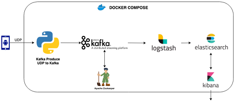

# 데이터 엔지니어링과 분산처리 기본 개념

## 데이터 엔지니어가 하는 일

 - 데이터 파이프라인 설계, 구축, 운영
 - Kubernetes 등 인프라 관리
 - 클라우드 인프라 관리
 - 네트워크 관리
 - 데이터 웨어하우스 구축, 관리
 - 대시보드 생성, 운영
 - Feature Engineering
 - 모델 서빙
 - GPU 등 리소스 관리
 - 데이터 마트 및 View 제공
 - ML 플랫폼 구축
 - 다양한 부서와의 협업
 - 데이터 파이프라인 설계, 구축, 운영
 - 인프라 관리
 - 데이터 가공
 - 데이터 연동
 - ETL/ELT 처리

## 분산 시스템에 대한 이해

분산 시스템이란 분산되어 있는 여러 서버를 하나의 서버처럼 다루는 시스템이다.

 - __복제__
    - 복제란 넽느워크로 연겨된 여러 장비에 동일한 데이터의 복사본을 유지하는 것
    - 리더 팔로워 방식을 사용. 복제 서버 중 한대를 리더로 사용하고 나머지 서버를 팔로워 서버로 사용한다.
    - 복제된 서버에도 같은 데이터가 있어야 같은 처리를 할 수 있다.
    - 클라이언트가 쓰기를 원할 때는 리더에게 요청을 해야 한다.
    - 요청을 받은 리더가 다른 팔로워들에게 동일한 요청을 보낸다.
    - 만약, 리더 서버에 장애가 발생한 경우 팔로워 중 하나를 리더로 선출한다. 새로 선출된 리더가 이전처럼 클라이언트의 요청을 처리한다.
 - __리더의 장애 상황 Fail Over 과정__
    - 팔로워 중 하나를 리더로 승격해야 한다. 클라이언트에도 새 리더로 쓰기를 요청하기 위한 재처리가 필요하다. 다른 팔로워들ㅇ느 새 리더로부터 달라진 데이터를 읽어야 한다.
    - 리더가 장애 상황인지 확인한다.(Health Check)
    - 선출 과정을 통해 새로운 리더를 선택한다. 가장 적합한 후보는 가장 최신의 데이터를 갖고 있는 팔로워가 된다.
    - 새로운 리더를 위한 시스템을 설정한다. 이전 리더가 팔로워가 되었다는 것을 알린다.
 - __팔로워의 장애 상황. 따라잡기__
    - 팔로워가 죽더라도 리더를 통해 매우 쉽게 복구할 수 있다.
    - 마지막 트랜잭션을 확인해 리더에 연결하고 연결이 끊어진 동안의 데이터 변경을 모두 요청하게 된다.

## 파티셔닝

데이터셋이 매우 크거나 쿼리 처리량이 매우 높을 때 데이터를 파티셔닝할 수 있다. 파티셔닝의 주된 이유는 확장성이다. 대용량 데이터 셋이 여러 디스크에 분산될 수 있고, 쿼리에 대한 부하를 여러 프로세서에 분산시킬 수 있다.

이때, 노드 사이에 쿼리 부하를 고르게 분산시키는 것이 중요하다. 고르게 분산되지 않아 한 쪽으로 쏠리는 것을 Skewed 되었다고 부른다. 불균형하게 높은 쿼리 부하가 걸리는 파티션을 핫스팟이라고 한다.

 - 파티션은 MongoDB, ElasticSearch, SoIR의 샤드와 같다.

### Key Value 데이터 파티셔닝

 - __Range Based Sharding__
    - 키 범위 파티셔닝, 연속된 범위(최소값 ~ 최대값)의 키를 할당
    - 데이터셋이 매우 클 때 또는 쿼리 처리량이 매우 높을 때 데이터를 파티셔닝
    - 파티션 경계는 수동으로 선택하거나 데이터베이스에서 자동으로 선택
 - __Hash Based Sharding__
    - 키의 해시값 기준 파티셔닝
    - 카산드라와 몽고DB는 MD5, Voldemort는 Fowler-Noll-Vo를 사용
    - 키에 적합한 해시 함수를 구하고 각 파티션에 해시값 범위를 할당한다. 해시값이 파티션의 범위에 속하는 모든 키를 그 파티션에 할당한다.

## 데이터 파이프라인의 종류

데이터 파이프라인이란 다양한 데이터 소스에서 RAW 데이터를 수집한 후 분석을 위해 Datalake 또는 Data warehouse 같은 데이터 저장소로 이전하는 방법을 말한다. 연결되는 구성이 파이프라인같다고 해서 데이터 파이프라인이라고 부른다.

서로 다른 여러 소스 시스템에서 데이터를 추출하고 해당 데이터를 변환, 결합 및 검증하고 대상 레포지토리에 로드하는 프로세스를 자동화한다. 종류로는 배치 파이프라인과 스트리밍 파이프라인이 존재한다.

### 배치 데이터 파이프라인

 - 배치 처리: 일정기간(일, 월 단위) 또는 한정된 데이터를 한 시점에 순서적으로 처리하는 방식
 - 맵 리듀스 기법인 하둡 또한 배치처리 방식이다.
 - 배치 처리 방식은 일정 기간의 데이터를 일괄적으로 처리한다.
 - 스케줄링이 필수적이다.

    

 

### ETL과 ELT

 - ETL(Extract Transform Load)
    - Extract: 소스 데이터로부터 추출
    - Transform: 추출된 데이터 변형
    - Load: 데이터 레이크로의 데이터 적재
 - ELT(Extract Load Transform)
    - ETL은 Transform에서 시간이 상당히 소요된다. 빅 데이터와, 데이터레이크의 등장으로 데이터의 중요성을 깨닫게 되어, 일단 적재하고 활용하게 되었다.

### 스트리밍 데이터 파이프라인

 - 끝없이 흐르는 데이터를 처리하기 위한 파이프라인
 - 분산 스토리지에 저장하지 않고 처리를 계속한다.
 - 실시간성이 중요한 경우에 사용이 되는 파이프라인
 - 대표적으로 ELK, Flink, Nifi 등이 있다.

    

 