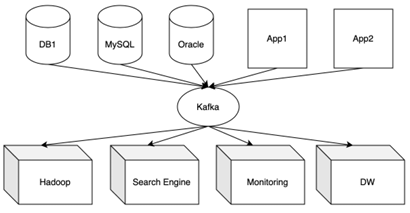
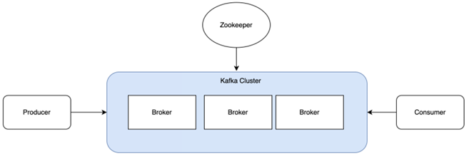
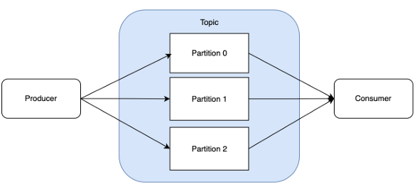

# Kafka란

Kafka는 대용량의 데이터 스트리밍 플랫폼으로, 주로 실시간 데이터 처리를 위해 사용됩니다. Apache Kafka는 LinkedIn에서 개발되어 현재는 Apache Software Foundation에서 오픈 소스로 관리하고 있습니다.

    

 

## Kafka 주요 구성 요소

 - Producer: 데이터를 Kafka에 쓰는 역할을 하는 애플리케이션입니다.
 - Consumer: 데이터를 Kafka에서 읽어가는 애플리케이션입니다.
 - Broker: 데이터를 저장하고 전달하는 Kafka 서버입니다.
 - Topic: 메시지가 게시되고 읽히는 카테고리입니다.
 - Partition: 각 토픽이 여러 파티션으로 나뉘어 저장되며, 이를 통해 높은 성능과 확장성을 제공합니다.

     
    

## 온프레미스와 매니지드 카프카

 - __온프레미스__
    - 서버에 직접 설치해서 운영
    - 기업의 비즈니스 정보를 높은 보안 레벨에서 관리가 가능
    - 장기적으로 사용 시 비용 효율 높음
    - 높은 초기 구축 비용
    - 시스템 구축에 별도의 시간 필요
    - 인프라를 관리를 위한 전담 이력 및 조직 필요
 - __매니지드__
    - 클라우드 서비스: 필요한 IT 리소스를 구입
    - IaaS: 인프라에 필요한 서버나 스토리지를 빌려서 사용 (EC2)
    - PaaS: 개발하고 구축하고 실행하는 데 필요한 개발 도구와 환경을 제공하는 서비스, 클라우드에서 완전한 개발 및 배포 환경을 제공
    - SaaS: 소프트웨어를 클라우드에서 구매해서 사용할 수 있음
 - __매니지드의 장점__
    - 인프라 관리: 자동으로 클러스터 복구, 스케일 인 아웃이 쉬움
    - 지표를 보기 쉬움: 내재된 대시보드 제공, 지표수집 쉬움
    - 보안과 인증서 자동 갱신: SSL, SSAL, ACL 등 보안 설정 제공, 접속 보안 설정 기본
 - __매니지드 적용이 필요한 경우__
    - 빠르게 확장해야 하는 경우
    - 전문 인력이 없는 경우
    - 카프카에 대한 노하우
