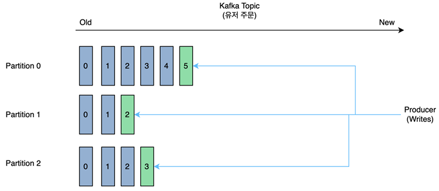
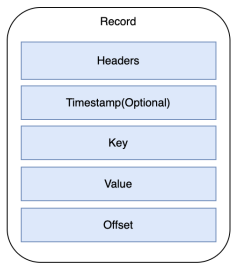
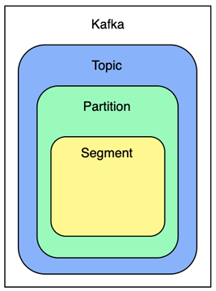
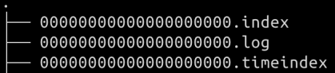

# Kafka 구조

## Broker

 - __데이터 저장 및 관리__
    - 프로듀서로부터 데이터를 받으면 토픽의 파티션에 데이터를 저장
    - 파일 시스템에 저장한다. 파일 시스템에 저장하므로 File I/O로 인해 속도 이슈 발생 가능
    - Page Cache를 통해 디스크 입출력 속도를 높임
    - 컨슈머가 데이터 요청 시, 파티션에 저장된 데이터를 전달
 - __데이터 분산 및 복제__ 
    - 데이터 복제를 통해 고가용성 달성
    - 장애 허용 시스템
    - 카프카의 데이터 복제 - 파티션 단위
    - Replication Factor 설정
    - 리더 팔로워 방식
    - 팔로워는 리더 파티션 오프셋 확인, 차이가 나면 리더로부터 가져와 저장한다. (2 이상 레플리케이션 팩터 설정 권장)
 - __데이터 삭제__
    - 데이터 삭제는 파일 단위로 이루어짐
    - 해당 파일 단위가 로그 세그먼트
    - 카프카 브로커에 log.segement.bytes 또는 log.segment.ms 옵션에 값이 설정되면 세그먼트 파일이 닫힘
    - 닫힌 세그먼트 파일은 log.retention.bytes 또는 log.retention.ms 옵션에 설정 값이 넘으면 삭제됨

## Zookeeper

Zookeeper는 분산 애플리케이션의 구성 관리, 동기화, 네이밍 서비스 등을 제공하는 Apache의 오픈 소스 프로젝트입니다. 분산 환경에서 시스템의 구성 정보를 중앙에서 관리하고, 상태를 모니터링하여 여러 노드 간의 일관성을 유지하는 역할을 합니다.

 - 분산 애플리케이션을 위한 코디네이션 시스템
 - Kafka, Nifi, Hbase, Hadoop 등에서 사용됨
 - 분산 시스템에서 발생 가능한 여러 문제들을 핸들링
    - 동기화 서비스 제공: 여러 분산 노드에서 동시에 접근하는 경우 발생할 수 있는 데이터 불일치를 방지합니다. 이를 통해 데이터의 일관성을 보장하며, 동기화된 정보가 유지되도록 돕습니다.
    - 분산 환경에서의 상태 관리: Zookeeper는 각 노드(Broker)가 살아 있는지, 정상적으로 작동 중인지 상태를 관리합니다. 이를 통해 시스템의 고가용성과 장애 복구를 지원합니다.
    - 클러스터 구성 정보 및 메타데이터 관리: Kafka에서 Zookeeper는 클러스터에 속한 Broker 목록, 각 토픽의 Partition 정보, 리더(Leader)와 팔로워(Follower) 정보 등을 관리합니다.
 - 부분 실패를 안전하게 처리하기 위한 분산 처리 도구
    - 네트워크로 연결된 두 노드 사이에 메시지가 전송된 상황에 메시지가 끊긴다면? 송신자는 수신자가 메시지를 수신했는지 모른다.
    - 수신자가 메시지는 받았지만 처리 중 죽었다면? 작업의 실패 여부조차 모르게 되는 상황
 - __Zookeeper 사용 목적__
    - 설정 관리, 클러스터 관리, 리더 채택, 락 및 동기화 서비스

## Topic과 Partition

### Topic

Topic은 Kafka에서 데이터를 분류하여 저장하고 관리하는 기본 단위입니다. Topic은 메시지를 그룹화하는 논리적인 개념으로, Producer가 데이터를 특정 Topic에 전송하면 Consumer가 해당 Topic을 구독하여 데이터를 읽어가는 구조입니다.

 - `데이터 분류`
    - __Topic을 통해 데이터의 종류나 목적에 따라 메시지를 분류__ 할 수 있습니다. 예를 들어, 사용자 활동 로그를 저장하는 user_activity라는 Topic과, 거래 정보를 저장하는 transactions라는 Topic을 생성하여 목적에 따라 데이터를 나눌 수 있습니다.
 - `Partition`
    - 각 Topic은 여러 Partition으로 나뉘어 저장되며, 이는 Kafka의 분산성과 확장성을 보장합니다.
    - Partition은 Topic에 속한 데이터의 물리적인 단위로, 각 Partition은 순서가 있는 메시지의 리스트로 구성됩니다.
    - Partition을 나눔으로써 동일한 Topic 내에서 여러 Broker에 데이터를 분산하여 저장할 수 있어 성능을 높이고 부하를 분산할 수 있습니다.

### Partition

Partition은 각 Topic을 물리적으로 나누어 저장하는 단위로, Kafka의 성능과 확장성을 높이기 위해 설계된 구조입니다. Partition은 Kafka의 분산 처리와 병렬성을 가능하게 해주는 중요한 요소입니다.

카프카 파티션의 각 레코드에는 오프셋(Offset) 이라는 식별자가 붙는다. 오프셋은 카프카에서 유지 관리하는 증분 및 변경 불가능한 숫자를 말하는데, 레코드가 파티션에 기록되면 다음 순차 오프셋을 할당하여 로그 끝에 추가한다. 파티션 내의 메시지는 순서가 정해져 있지만 토픽 전체의 메시지는 순서가 보장되지 않는다.

 - `데이터 분산 및 병렬 처리`
    - __각 Topic은 여러 Partition으로 나누어질 수 있으며, Partition은 여러 Broker에 분산 저장__ 됩니다. 이로 인해 데이터를 병렬로 처리할 수 있어 대규모 데이터 처리가 가능합니다.
    - Producer가 특정 Partition에 메시지를 보내면, Consumer는 여러 Partition에서 동시에 데이터를 처리할 수 있어 높은 처리량을 제공합니다.
 - `순서 보장`
     - __Kafka는 특정 Partition 내에서는 메시지의 순서를 보장__ 합니다. 즉, 같은 Partition에 저장된 메시지들은 저장된 순서대로 Consumer에게 전달됩니다.
    - Partition 간에는 순서가 보장되지 않으므로, 특정 메시지의 순서가 중요하다면 동일한 Partition에 저장해야 합니다.
 - `키 기반 라우팅`
    - Producer는 특정 키(예: 사용자 ID, 주문 ID 등)를 기준으로 메시지를 특정 Partition에 보내도록 설정할 수 있습니다. 이 키 기반 라우팅을 통해 데이터를 특정 Partition에 고정하여 데이터의 일관성을 유지할 수 있습니다.
    - 예를 들어, 동일한 사용자의 메시지가 항상 동일한 Partition에 저장되도록 설정할 수 있습니다.

    

 

### 파티셔닝 효과

 - 브로커에서 파티션을 분산하면 수평적으로 확장하는 효과, 싱글 브로커보다 훨씬 뛰어난 성능을 제공
 - 다른 컨슈머들이 토픽을 병렬적으로 사용 가능, 여러 파티션을 설정하면 더 많은 컨슈머를 사용할 수 있게 됨
 - 매우 높은 메시지 처리량, 각 컨슈머의 인스턴스는 한 파티션에서 메시지를 제공받게 됨, 각 레코드는 메시지 처리 담당자가 존재하게 된다.

### 파티셔닝 방법

 - `파티션 키 사용`
    - 파티션 키를 사용할 데이터를 설정
    - 해싱 함수를 통해 전달됨
    - 동일 키로 생성한 모든 레코드는 동일 파티션에 저장됨. 정확한 순서가 보장될 수 있음
    - 키가 잘 분산되지 않을 가능성이 있음 (한 고객 ID가 전체 트래픽의 70% 이상을 발생시키면 브로커가 다운될 수 있음)

###  파티션에서 레코드 읽는 과정

 - 컨슈머가 브로커 파티션에 연결하고 순서대로 메시지를 읽음
 - 오프셋이 컨슈머의 커서로 작동함
 - 컨슈머는 오프셋을 트래킹하면서 사용한 메시지를 추적함
 - 컨슈머는 메시지를 읽고 다음 오프셋으로 이동
 - 각 파티션에 마지막으로 소비된 메시지의 오프셋을 기억함
 - 어떤 시점에 파티션에 들어가더라도 오프셋 위치에서 작업을 재개할 수 있음
 - 하나 이상의 컨슈머가 있더라도 문제 없음
 - 각 컨슈머는 각 파티션에 대해 어디까지 읽었는지 자신만의 기록을 가지게 됨

### 적절한 파티션 수

 - 파티션이 많으면 동시 처리량이 늘어지만, 많아진 상태에서 노드가 다운되는 경우 복구가 복잡해지고, 리소스가 많이 소비된다.
 - 적절한 파티션 수를 얻기 위해서는 원하는 목표 처리량의 기준이 필요하다.
    - 프로듀서 3개에 초당 10 개의 메시지를 보낸다면, 토픽에서는 최소한 초당 30개의 메시지를 받아줘야 한다.
    - 1개 파티션이 1초에 10개를 받아준다면, 파티션을 최소 3개로 늘려 이를 처리할 수 있도록 구성
 - 파티션을 늘린 다음에 줄일 수는 없기 떄문에, 적은 수의 파티션으로 운영하면서 늘려주는 것이 이상적이다.

## Record와 Segment

### Record

Record는 Kafka가 저장하고 처리하는 데이터의 기본 단위입니다. Record는 Producer가 Kafka에 보내는 메시지를 의미한다.

 - __Key__: 메시지의 키로, 특정 Partition에 메시지를 할당하는 데 사용됩니다. 이를 통해 동일한 키를 가진 메시지는 항상 동일한 Partition에 저장될 수 있습니다.
 - __Value__: 메시지의 실제 데이터 값입니다. Kafka는 다양한 형식의 데이터를 Value에 담을 수 있으며, JSON, XML, String 등으로 저장할 수 있습니다.
 - __Offset__: Partition 내에서 Record의 고유한 번호로, 메시지가 저장된 위치를 나타냅니다. Consumer는 이 Offset을 사용하여 데이터를 가져올 수 있습니다. Offset은 고유하기 때문에 같은 Partition 내에서 순서를 보장합니다.
 - __Timestamp__: 메시지가 생성된 시간 또는 Kafka에 저장된 시간을 나타냅니다.

   

 

### Segment

Segment는 Kafka에서 Partition의 데이터를 물리적으로 저장하는 파일 단위입니다. Kafka는 각 Partition을 여러 Segment 파일로 나누어 저장하여 데이터의 관리를 용이하게 합니다.

세그먼트는 파티션에서 확장된 개념으로 프로듀서가 전송한 메시지가 브로커의 로컬 디스크에 저장되는데 이때 저장되는 파일이다. 메시지의 키, 오프셋, 크기에 대한 정보도 함꼐 저장된다.

 - __로그 파일 구조__: Segment는 Kafka의 로그(log) 파일로, Partition 내에서 여러 Record가 시간 순서대로 저장된 파일입니다. 이를 통해 메시지의 순서가 보장되며, 각 Segment 파일에 여러 Record가 기록됩니다.
 - __Segment Rotation__: Kafka는 특정 조건(크기 또는 시간)에 도달할 때마다 새로운 Segment 파일을 생성합니다. 이를 통해 단일 파일의 크기를 제한하고, 보다 효율적인 파일 접근과 데이터 관리가 가능합니다.
 - __Offset 기반 접근__: Kafka는 각 Segment 파일에 Offset 범위를 기록해 두어 특정 Offset에 접근할 때 빠르게 해당 Segment를 찾아 접근할 수 있습니다.
 - __데이터 보관 기간__: Kafka는 설정에 따라 Segment 파일을 일정 기간 동안 보관한 뒤 삭제하거나 압축할 수 있습니다. 이를 통해 오래된 데이터를 관리하고 저장 공간을 절약할 수 있습니다.

    
   

 

#### 세그먼트와 삭제

 - 특정 레코드에 대한 삭제는 불가능
 - 삭제 단위는 무조건 세그먼트
 - retention.ms: 레코드 보유 기간
   - disk pressure 오는 경우 이 옵션을 수정하기도 함
 - retention.bytes: 지정한 크기에 도달하면 세그먼트를 삭제함 (기본값은 지정되지 않음)
   - 액티브 세그먼트는 삭제되지 않음
 - log.retention.check.interval.ms: 브로커에서 세그먼트가 삭제될 만한지 체크하는 주기

#### 세그먼트의 수정

 - 이미 적재된 레코드에 대해서는 수정이 불가능
 - 데이터 검증을 미리 하고 적재하는 것이 중요
 - 데이터 적재하는 프로듀서측에서 검증하고 데이터를 사용하는 컨슈머에서도 검증 필요

## ISR

Kafka에서 ISR(In-Sync Replicas)은 현재 리더와 동기화된 복제본 목록을 의미합니다.

 - __In-Sync 상태__
   - ISR에 포함된 복제본(Replica)은 리더 Partition과 일정 수준의 동기화를 유지하는 복제본들입니다.
   - Kafka는 replica.lag.max.ms라는 설정을 통해 ISR의 조건을 결정합니다. 이 값은 리더와 팔로워 간의 최대 지연 시간으로, 팔로워가 이 시간보다 더 오래 동기화되지 않으면 ISR에서 제외됩니다.
 - __리더와 팔로워 구조__
   - Kafka의 각 Partition에는 리더(Leader)와 여러 팔로워(Follower)가 있으며, 리더는 쓰기 작업을 담당합니다.
   - 리더가 데이터에 변경 사항을 기록하면, ISR에 포함된 팔로워 복제본들은 리더의 데이터를 실시간으로 복제하여 동기화 상태를 유지합니다.
 - __고가용성 보장__
   - ISR 목록에 있는 복제본들은 모두 최신 데이터를 보유하고 있으므로, 리더가 장애가 발생할 경우 ISR 내의 팔로워 중 하나가 자동으로 리더로 승격됩니다. 이를 통해 데이터의 가용성과 안정성이 보장됩니다.
 - __일관성 보장__
   - Kafka는 설정에 따라 ISR에 있는 모든 복제본이 데이터를 수신했을 때만 기록을 완료하는 옵션을 제공합니다. 이를 통해 데이터의 일관성과 내구성을 유지할 수 있습니다.
   - acks=all로 설정하면 ISR에 있는 모든 복제본에 기록이 완료될 때까지 Producer에 대한 응답을 지연할 수 있어 데이터 손실을 방지할 수 있습니다.

ISR에 속해 있는 구성원만이 리더의 자격을 가진다. 리더 파티션이 다운되었을 때, ISR에 있는 파티션 중 하나가 리더로 승격된다. 리더는 팔로워들이 주기적으로 데이터를 싱크하는지 확인한다. 일정 주기만큼 확인 후, 팔로워에서 요청이 없으면 리더는 해당 팔로워의 이상을 감지한다. 해당 팔로워는 리더의 역할을 대신할 수 없으므로 ISR 그룹에서 해당 팔로워를 추방한다.

