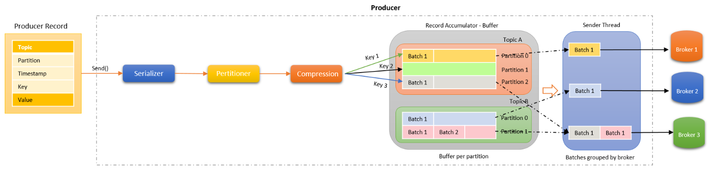

# 프로듀서

**프로듀서(Producer)**는 데이터를 생성하여 특정 Kafka Topic에 전송하는 역할을 하는 애플리케이션이나 컴포넌트입니다.

키 값을 정하면 해당 키를 가진 모든 메시지를 동일한 파티션으로 전송이 가능하다. 만약, 키 값을 입력하지 않으면 파티션은 라운드 로빈 방식으로 파티션에 균등하게 분배된다.

## 프로듀서 특징

 - `메시지 전송`
    - Producer는 Kafka Broker에 데이터를 전송하며, 이 데이터는 Record 형태로 전송됩니다.
    - 각 Record는 특정 Topic의 Partition에 할당되어 저장됩니다.
 - `Partition 선택`
    - Producer는 특정 키(예: 사용자 ID)를 사용하여 메시지를 특정 Partition에 할당할 수 있습니다. 동일한 키를 가진 메시지는 항상 동일한 Partition에 저장되므로, 데이터의 순서를 보장할 수 있습니다.
    - 키가 지정되지 않은 경우, Producer는 Round-Robin 방식이나 다른 정책을 통해 Partition을 자동으로 선택할 수 있습니다.
 - `전송 보장 수준`
    - Producer는 데이터 전송의 신뢰성을 보장하기 위해 acks 설정을 제공합니다. 이 설정에 따라 Kafka에 데이터를 보장하는 수준이 달라집니다:
    - __acks=0__: __Producer는 데이터 전송 후 확인을 기다리지 않고 바로 다음 메시지를 전송__ 합니다. 가장 빠르지만 데이터 손실 가능성이 큽니다.
    - __acks=1__: 리더 복제본이 데이터를 기록했음을 확인할 때 응답을 받습니다. __속도와 신뢰성의 균형을 맞출 수 있습니다.__
    - __acks=all__: ISR의 모든 복제본이 데이터를 수신한 후 응답을 받습니다. __가장 높은 신뢰성을 보장하지만 속도가 느릴 수 있습니다.__
 - `재시도와 장애 처리`
    - Kafka Producer는 네트워크 문제나 Broker의 일시적 장애로 인해 데이터 전송에 실패할 수 있습니다. 이를 대비해 Producer는 재시도 설정(retries)을 통해 자동으로 메시지 전송을 다시 시도합니다.
    - 또한, retry.backoff.ms 설정을 통해 재시도 간격을 조정할 수 있어, 성능을 최적화할 수 있습니다.
 - `배치 전송`
    - Producer는 여러 메시지를 한 번에 전송하여 네트워크 효율성을 높이기 위해 배치(batch) 전송 기능을 사용합니다. batch.size와 linger.ms 설정을 통해 배치 크기와 전송 대기 시간을 조정할 수 있습니다.
    - 배치를 통해 네트워크 비용을 줄이고, Kafka의 처리 효율을 높일 수 있습니다.
 - `압축`
    - Producer는 전송되는 데이터의 크기를 줄이기 위해 압축을 사용할 수 있습니다. Kafka는 gzip, snappy, lz4, zstd 등의 압축 방식을 지원하며, 이를 통해 네트워크 성능을 최적화할 수 있습니다.

## 프로듀서 구조

 - 오프셋은 레코드가 생성될 때에는 포함되지 않는다. 토픽과 메시지 값만 있어도 전송하는데에는 이상이 없다.
 - send()를 통해 레코드를 전송하고, 실제 전송되는 건 뒤의 처리가 끝난 이후 Partitioner, Accumulator, Sender가 끝나야 전송이 실제로 이루어진다.
 - Partitioner: 어떤 파티션으로 보낼지 설정한다. 기본값은 DefaultPartitioner이다. 만약, 데이터의 순서를 보장하고 싶다면 메시지 키를 지정하여 특정 파티션으로 전송할 수 있다.
 - Compression: 사용자가 전송하려는 Record를 압축을 통해서 네트워크 전송 비용을 줄이고, 저장 비용도 줄일 수 있다. compression.type을 설정하여 코덱을 지정할 수 있다. (none, gzip, snappy, lz4 등)
 - Accumulator: 네트워크 전송은 매우 무거운 처리이다. 프로듀서는 지정된 만큼 메시지를 저장했다가 한 번에 브로커로 전달하여 높은 처리량을 달성할 수 있다. 이러한 과정을 Record Accumulator(RA)가 담당하여 처리한다. RA는 각 토픽 파티션에 대응하는 배치 큐를 구성하고 메시지들을 레코드 배치 형태로 묶어 큐에 저장한다.
 - Sender: 각 배치 큐에 저장된 레코드 배치들은 때가 되면 각각 브로커에 전달되는데 이 과정을 Sender가 처리한다. Sender는 스레드 형태로 구성되며, 관리자가 설정한 특정 조건에 만족하는 레코드 배치를 브로커로 전송한다.

    

## 프로듀서 주요 옵션들

 - bootstrap.servers: 카프카 클로스터에 연결을 하기 위한 호스트와 포트 정보 입력
 - buffer.memory: 프로듀서가 카프카 서버로 데이터를 보내기 위해 대기할 수 있는 전체 메모리 바이트
 - batch.size: 같은 파티션으로 보내는 여러 데이터를 배치로 보내려고 시도, 정의된 크기보다 큰 데이터는 배치 전소을 시도 하지 않는다. 고가용성이 필요하다면 배치 사이즈를 주지 않는다.
 - key.serializer: 레코드의 메시지 키를 직렬화하는 클래스 지정
 - value.serializer: 레코드의 메시지 값을 직렬화하는 클래스 지정
 - linger.ms: Accumulator에 있는 배치를 전송하기 전까지 기다리는 최소 시간. 배치를 최대한 모아서 보내고 싶다면 값을 늘려준다.
 - max.request.size: 프로듀서가 보낼 수 있는 최대 메시지 바이트 사이즈. 기본값은 1MB
 - retries: 브로커로부터 에러를 전달받고 재전송을 시도하는 횟수. 기본값은 2147483647로 매우 크다.
 - max.in.flight.requests.per.connections: 한 번에 요청하는 최대 커넥션 개수. 설정 값만큼 동시 요청. 기본값은 5
 - max.request.size: 프로듀서가 보낼 수 있는 최대 메시지 바이트 사이즈. 기본값은 1MB
 - delivery.timeout.ms: acks를 받지 못한 메시지에 대해 설정된 시간만큼 retry를 진행. 시간이 지나도록 받지 못한 메시지는 fail 된다.
 - *acks: 0, 1, -1(all) 중 하나를 선택. 기본값은 1로 프로듀서가 전송한 데이터가 브로커들에 정상적으로 들어갔는지 전송 성공 여부를 확인한다.
 - partitioner.class: 파티셔너 클래스 지정. 기본값은 org.apache.kafka.clients.producer.internals.DefaultPartitioner이다. 2.5.0 이후부터는 UniformStickyPartitioner 사용
 - enable.idempotence: 멱등성 프로듀서 동작 여부. 기본값은 false이며, 3.0.0 부터는 true로 변경되었다.
 - transaction.id: 레코드를 트랜잭션 단위로 묶을지 여부. 기본값 null

## 프로듀서 acks

### acks = 0

프로듀서가 리더 파티션으로 데이터를 전송만 한 것으로 실제 저장까지 되었는지 여부를 확인하지 않는다.

 - 신뢰성 정도가 가장 낮음
 - 단순히 send() 호출
 - 데이터 유실을 감당할 수 있는 경우 사용하면 좋음

### acks = 1

프로듀서가 보낸 데이터가 리더 파티션에 정상적으로 적재되었는지 확인한다. 적재가 되지 않았다면, 될 떄 까지 시도할 수 있다.

 - 신뢰성 중간 정도
 - 팔로워 파티션까지 데이터가 적재되었다는 것을 보장하지는 않는다.

### acks = -1(all)

프로듀서가 보낸 데이터가 리더, 팔로워 파티션에 정상적으로 적재되었는지 확인한다.

 - 신뢰성 정도가 가장 높음
 - 처리 속도가 매우 느리다. 꼭 필요한 경우에만 사용한다.
 - 브로커 장애에도 데이터 저장을 보장할 수 있다.
 - min.insync.replicas 옵션 값에 따라 팔로워 갯수까지 확인한다. 만약, 1이라면 리더와 팔로워 1개까지 확인한다.

