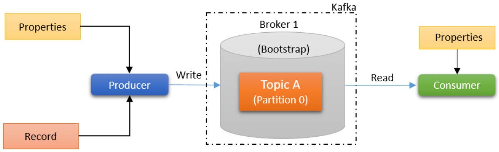
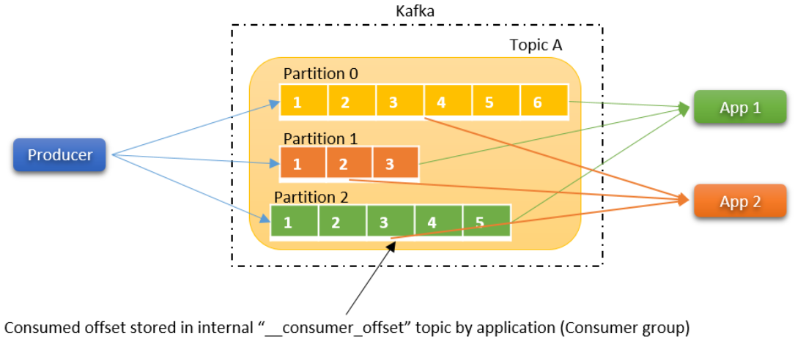
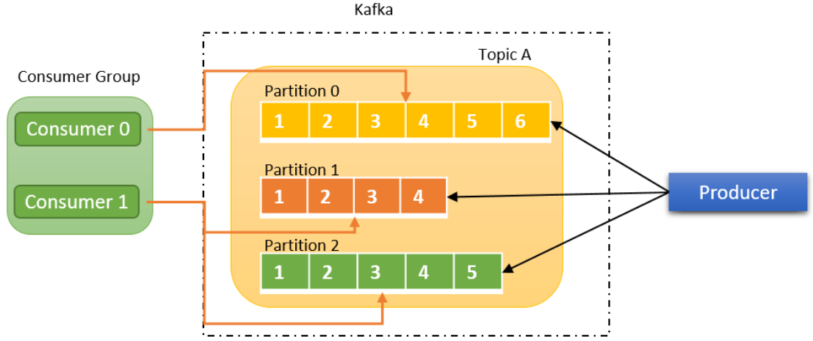
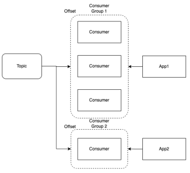
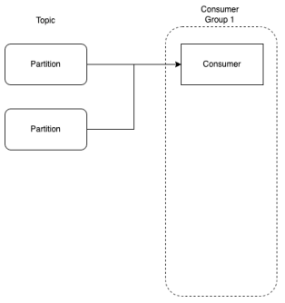
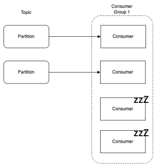
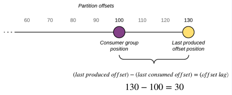
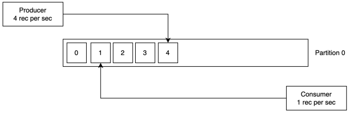
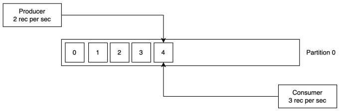
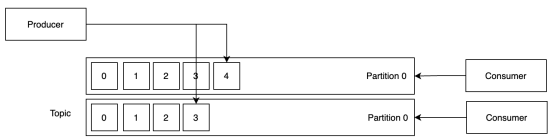

# 컨슈머

 **컨슈머(Consumer)**는 Kafka Topic으로부터 메시지를 읽어 가공, 처리, 저장, 분석 등의 작업을 수행하는 애플리케이션 또는 컴포넌트입니다. Consumer는 실시간 데이터 처리를 통해 여러 응용 프로그램이나 시스템이 필요한 데이터를 즉시 사용할 수 있게 해줍니다.

## 컨슈머 특징

 - `메시지 소비`
    - Consumer는 Kafka에서 메시지를 순차적으로 읽어옵니다. __Kafka는 특정 Partition 내에서만 메시지의 순서를 보장하므로, Consumer는 동일한 Partition에 있는 메시지를 읽는 동안 순서가 유지__ 됩니다.
    - Consumer는 poll() 메서드를 사용하여 Broker에서 메시지를 가져옵니다. 이는 일반적으로 주기적으로 실행되어 새로운 메시지를 지속적으로 수신합니다.
 - `Consumer Group`
    - Consumer는 Consumer Group으로 묶여서 작동할 수 있으며, 이를 통해 __동일한 Topic의 데이터를 여러 Consumer가 나누어 처리__ 할 수 있습니다.
    - __각 Consumer Group 내에서 각 Partition은 하나의 Consumer에게만 할당__ 됩니다. 이를 통해 메시지가 중복되지 않고 고유하게 각 Consumer에 전달됩니다.
    - 여러 Consumer Group이 동일한 Topic을 구독할 수 있으며, 각 그룹은 독립적으로 데이터를 처리할 수 있습니다.
 - `Offset 관리`
    - __Consumer는 Partition 내에서 메시지를 읽어온 위치를 Offset으로 관리__ 합니다. Kafka는 Consumer가 __마지막으로 읽은 메시지의 Offset을 저장하여 Consumer가 재시작할 때 중단된 위치부터 읽을 수 있게 합니다.__
    - Offset 관리는 자동(enable.auto.commit)으로 설정할 수도 있고, 수동으로 Offset을 커밋하여 정확한 데이터 처리를 보장할 수도 있습니다.
 - `리밸런싱(Rebalancing)`
    - Consumer Group 내에서 Consumer가 추가되거나 제거될 때 Kafka는 리밸런싱을 수행하여 Partition을 다시 할당합니다. 이를 통해 Consumer가 가용한 Partition을 최대한 효율적으로 처리할 수 있게 합니다.
    - 리밸런싱은 데이터 처리 중에 잠시 중단을 초래할 수 있지만, 시스템 전체의 데이터 처리 능력을 동적으로 조정할 수 있게 해줍니다.
 - `에러 처리와 재시도`
    - Consumer는 메시지를 처리하는 과정에서 오류가 발생할 수 있으며, 이를 위해 Kafka는 에러 처리 및 재시도 메커니즘을 제공합니다.
    - Consumer는 실패한 메시지를 다시 처리하거나, 실패한 메시지를 다른 로그나 별도의 Topic에 기록하여 추후 처리할 수 있습니다.
 - `데이터 처리 방식`
    - Consumer는 데이터를 순차적으로 처리하거나 비동기적으로 처리할 수 있습니다. 비동기 처리는 Consumer가 메시지를 빠르게 처리하고 다음 메시지를 가져오는데 적합합니다.
    - 비동기 처리의 경우 데이터 처리의 순서를 엄격히 유지해야 하는 경우에는 별도의 조정이 필요할 수 있습니다.

## 컨슈머 구조

 - Polling 구조
    - 컨슈머가 원하는 만큼 카프카 브로커에 요청

    

 

 - Multi-app Consumption
    - 메시지가 삭제되지 않기 때문에 한 토픽에 대해 서로 다른 앱이 각자의 데이터를 가져와서 읽을 수 있다.
    - 컨슈머 오프셋 이라는 토픽에 각 앱들이 어디까지 읽었는지 저장함. 컨슈머가 다운되더라도 오프셋을 보고 재개할 수 있음

    

 

 - 컨슈머 그룹
    - 하나 이상의 컨슈머들이 컨슈머 그룹을 이룰 수 있음
    - 한 토픽에 있는 데이터를 여러 앱 컨슈머 그룹에서 가져갈 수 있음

    

 

## 컨슈머 그룹의 이해

**컨슈머 그룹(Consumer Group)**은 여러 Consumer가 하나의 그룹으로 묶여서 동일한 Topic을 처리하는 개념입니다.

 - 각 Consumer Group은 고유의 Offset을 관리하며, 이는 Consumer Group이 처리 중인 각 Partition의 위치를 나타냅니다. Kafka는 이 Offset을 Zookeeper나 Kafka 내부의 __consumer_offsets Topic에 저장하여 Consumer가 재시작되더라도 중단된 위치에서부터 다시 데이터를 처리할 수 있도록 합니다.
 - Offset 관리 방식은 Consumer의 장애 복구를 가능하게 하고, 데이터 중복 처리나 누락을 방지하는 데 중요한 역할을 합니다.

    

 

### 컨슈머 개수가 파티션 개수보다 적다면

컨슈머는 토픽의 파티션을 모두 구독할 것이다. 컨슈머는 열심히 메시지를 소비할 것이지만, 컨슈머 자체가 부족하다보니 파티션의 메시지를 모두 처리하는 처리량이 적을 것이다.

그렇다 보면, 토픽에 점점 메시지가 쌓일 것이다. 프로듀서가 보내는 데이터 양보다 컨슈머의 데이터 처리량이 부족한 상황으로 데이터파이프라인의 실시간성을 떨어뜨리며 지연이 발생하게 된다.

    

 

### 컨슈머 개수가 토픽 파티션 개수보다 많다면

아무리 컨슈머를 늘려도 처리량을 늘릴 수 없다. 파티션은 이미 컨슈머의 할당이 되어있고 남은 컨슈머들은 유휴상태에 빠진다.

    

 

## 컨슈머 랙

**컨슈머 랙(Consumer Lag)**은 Consumer가 최신 데이터를 처리하는 속도와 실제로 데이터가 Kafka에 쌓이는 속도 간의 지연 차이를 의미합니다. 간단히 말해, 특정 Consumer가 Kafka의 최신 메시지를 처리하는 데 걸리는 지연 시간을 나타냅니다. Consumer Lag은 Kafka의 성능 및 시스템 상태를 모니터링하고 최적화하는 데 중요한 지표로 사용됩니다.

 - 컨슈머 랙이란 토픽의 최신 오프셋과 컨슈머 오프셋 간의 차이를 말한다.
 - 프로듀서는 파티션에 데이터 저장, 컨슈머는 데이터를 가져가는 구조이다.
 - 컨슈머 랙을 통해 카프카 컨슈머의 상태를 확인할 수 있다.

    

 

### 프로듀서 전송량이 컨슈머 처리량보다 크다면?

컨슈머 랙(오프셋 차이)이 점점 더 늘어날 것이다. 이러한 경우 컨슈머 처리량을 늘려서 차이를 줄여야 한다. 컨슈머 랙이 쌓이다 보면 실시간성을 해칠 수 있다.

    

 

### 프로듀서 전송량이 컨슈머 처리량보다 작다면?

컨슈머 랙이 0이 된다.

    

 

### 컨슈머 랙 해결 방법

기존에 프로듀서에 대해서 컨슈머 하나로 처리하고 있었을 때, 갑자기 프로듀서의 전송량이 늘어난다고 가정한다. 그러면 컨슈머 랙이 늘어나게 된다.

이러한 경우 파티션 수를 늘려주고, 컨슈머가 가져갈 수 있게 컨슈머의 수도 늘려준다면 이를 처리할 수 있다.

    

 

## 컨슈머 주요 옵션

 - bootstrap.servers: 브로커의 정보
 - fetch.min.bytes: 한 번에 가져올 수 있는 최소 데이터 크기. 만약 지정한 크기 보다 작은 경우 요청에 응답하지 않고 데이터가 누적될 때까지 기다린다.
 - group.id: 컨슈머가 속한 컨슈머 그룹을 식별하는 식별자. 동일한 그룹 내의 컨슈머 정보는 모두 공유된다.
 - heartbeat.interval.ms: 하트비트가 있다는 것은 컨슈머의 상태가 active
    - session.timeout.ms와 밀접한 관계가 있다.
    - session.timeout.ms보다 낮은 값으로 설정해야 한다. (일반적으로 1/3 값으로 설정)
 - session.timeout.ms: 이 시간을 이용해, 컨슈머가 종료된 것인지를 판단. 컨슈머는 주기적으로 하트비트를 전송하는데, 만약 이 시간 전까지 하트비트를 보내지 않았다면, 해당 컨슈머는 종료된 것으로 간주하고 컨슈머 그룹에서 제외. 리밸런싱 시작
 - max.partition.fetch.bytes: 파티션당 가져올 수 있는 최대 크기
 - enable.auto.commit: 백그라운드로 주기적으로 오프셋을 커밋
 - auto.offset.reset: 카프카에서 초기 오프셋이 없는 경우, 또는 현재 오프셋이 더 이상 존재하지 않는 경우 아래 옵션으로 초기화
    - earliest: 가장 초기의 오프셋 값으로 설정
    - latest: 가장 마지막의 오프셋 값으로 설정
    - none: 이전 오프셋 값을 찾지 못하면 에러
 - fetch.max.bytes: 한 번의 fetch 요청으로 가져올 수 있는 최대 크기
 - group.instance.id: 컨슈머의 고유한 식별자. 설정 시 static 멤버로 간주되어 불필요한 리밸런싱을 하지 않음
 - max.poll.records: 한 번의 poll() 요청으로 가져오는 최대 메시지 수
 - fetch.max.watt.ms: fetch.mln.bytes에 의해 설정된 데이터보다 적은 경우 요청에 대한 응답을 기다리는 최대 시간
