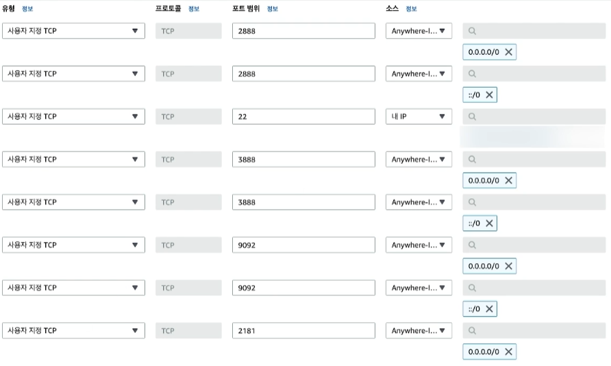

# Kafka 브로커 실행하기

## 1. AWS EC2에 카프카 설정하기

```bash
# JDK 설치
$ sudo apt-get update
$ sudo apt-get install openjdk-11-jdk

# Kafka 설치
$ wget http://mirror.navercorp.com/apache/kafka/3.3.2/kafka_2.13-3.3.2.tgz
$ tar -xvzf kafka_2.13-3.3.2.tgz

# Kafka 홈 지정
$ vi ~/.bashrc
..
export KAFKA_HOME=/home/ubuntu/kafka/kafka_2.13-3.3.2

$ source ~/.bashrc
$ echo $KAFKA_HOME

# /etc/hosts 설정: server_ip에는 private ip를 입력해준다.
$ sudo vi /etc/hosts
{server_ip} kafka_node1
{server_ip} kafka_node2
{server_ip} kafka_node3

# Kafka 설정
$ vi $KAFKA_HOME/config/server.properties
..
broker.id=1
listeners=PLAINTEXT://:9092
advertised.listeners=PLAINTEXT://kafka_node1:9092
log.dirs=/home/ubuntu/kafka/kafka_2.13-3.3.2/logs
zookeeper.connect=kafka_node0:2181,kafka_node1:2181,kafka_node2:2181
```

 - Zookeeper 설정
    - initLimit: follower가 leader와 처음 연결을 시도할 때 가지는 tick 횟수. 제한 횟수를 넘으면 timeout
    - syncLimit: follower가 leader와 연결 된 후에 앙상블 안에서 leader와의 연결을 유지하기 위한 tick 횟수. 제한 횟수를 넘으면 timeout
    - server.*: 앙상블을 이루기 위한 서버의 정보. 2888은 동기화를 위한 포트, 3888은 클러스터 구성시 leader를 산출하기 위한 포트. 여기서 서버의 id 를 dataDir 에 설정해 줘야 한다.
```bash
$ vi $KAFKA_HOME/config/zookeeper.properties
..
dataDir=/home/ubuntu/kafka/kafka_2.13-3.3.2/data
initLimit=20
syncLimit=5
server.1=kafka_node1:2888:3888
server.2=kafka_node2:2888:3888
server.3=kafka_node3:2888:3888

$ echo "1" > $KAFKA_HOME/data/myid
```

 - 보안 그룹 설정

<div align="center">
    
</div>
<br/>
 
 - Kafka 인스턴스 실행
```bash
# kafka_node1
$KAFKA_HOME/bin/zookeeper-server-start.sh -daemon $KAFKA_HOME/config/zookeeper.properties
$KAFKA_HOME/bin/kafka-server-start.sh -daemon $KAFKA_HOME/config/server.properties

# kafka_node2
$KAFKA_HOME/bin/zookeeper-server-start.sh -daemon $KAFKA_HOME/config/zookeeper.properties
$KAFKA_HOME/bin/kafka-server-start.sh -daemon $KAFKA_HOME/config/server.properties

# kafka_node3
$KAFKA_HOME/bin/zookeeper-server-start.sh -daemon $KAFKA_HOME/config/zookeeper.properties
$KAFKA_HOME/bin/kafka-server-start.sh -daemon $KAFKA_HOME/config/server.properties
```

 - 예시
```bash
# 토픽 생성
$ bin/kafka-topics.sh --create --bootstrap-server kafka_node1:9092 --replication-factor 1 --partitions 5 --topic test

$ bin/kafka-topics.sh --list --bootstrap-server kafka_node1:9092
```
