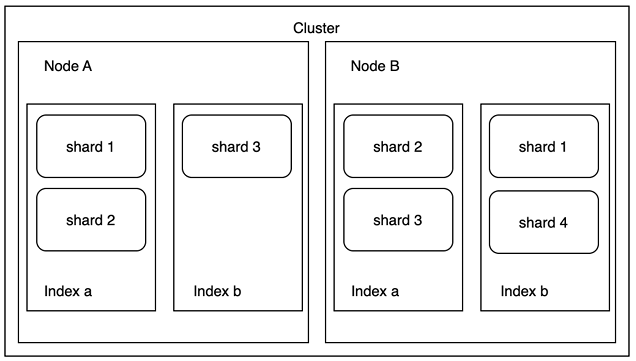
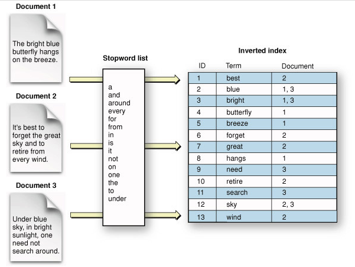

# ElasticSearch 기본 구성

## ElasticSearch 아키텍처

 - 인덱스
    - ElasticSearch에 저장하는 것을 인덱싱
    - 인덱스 명으로 문서를 검색
    - 분산 환경에서 인덱스는 여러 노드에 분산되어 저장
 - 샤드
    - 샤드를 통해 데이터의 안정성을 높임
    - 인덱스의 저장 단위, 노드에 분산되어 저장
 - 타입
    - 인덱스의 논리적 구조
    - 7.0+ 부터는 인덱스 당 하나의 타입 제공
 - 문서
    - 문서는 데이터가 저장되는 최소 단위
    - 한 문서는 다수의 필드로 구성됨
    - nested 구조를 지원
 - 필드
    - 문서를 구성하는 속성
    - 컬럼과 비슷한 개념
    - 한 필드는 여러 데이터 타입을 가질 수 있다. 
 - 매핑
    - 데이터의 저장 형태와 검색을 위해 데이터를 어떻게 접근하고 처리할지
    - 문서의 필드와 필드의 속성을 정의, 인덱싱 방법을 정의
    - 인덱스 매핑에서는 여러 데이터 타입이 지정 가능하지만 필드명은 중복 사용 불가

## 클러스터, 노드

 - 클러스터
    - 노드의 집합
    - 모든 노드를 포괄하는 통합 색인화 및 검색 기능 제공
 - 노드
    - ElasticSearch를 구성하는 서버
    - 데이터를 저장하고 클러스터의 Indexing 및 검색 기능
    - 노드에도 고유한 이름이 존재 (기본 UUID)
    - 클러스터 이름을 통해 해당 클러스터에 속할 수 있음
    - 마스터 노드
        - 클러스터 상태 정보를 관리
        - 마스터 노드는 하나, 최소 마스터 노드 대수 설정 필요
    - 데이터 노드
        - 문서가 저장되는 노드, 샤드가 배치된다.
        - 인덱싱 작업에 리소스를 많이 소모하므로 리소스 모니터링이 필수적

    

### Split Brain 현상

 - 마스터 후보 노드간 네트워크가 단절되었을 때 각각의 마스터 후보 노드가 마스터로 승격, 두 개의 클러스터로 나뉘어 독립적으로 동작하는 현상
 - 양쪽 클러스터에서 각각 데이터 쓰기, 업데이트가 이루어지면서 네트워크가 복구되어도 마스터가 따로 존재하기 떄문에 데이터 비동기 문제로 데이터의 문제가 발생

### Split Brain 해결 방법

 - discovery.zen.minimum_master_nodes 설정(master_eligible_nodes / 2) + 1
 - 마스터 노드 후보 개수를 홀수로 설정

## 역색인

역색인과 형태소 분석은 검색엔진의 핵심 기능으로 키워드(Term)을 기반으로 빠르게 원하는 문서를 탐색하기 위해 활용된다.

일반적인 데이터베이스에서는 단방향 색인을 사용한다. 따라서, 특정 키워드를 포함하고 있는 문서를 찾기 위해서는 모든 문서의 내용을 읽어서 키워드의 포함 여부에 대한 검사가 이루어져야 한다. 이러한 과정은 상당한 연산을 수반하며, 별도의 캐싱 로직을 추가하지 않는 이상 동일한 요청에 대해서도 같은 작업이 반복되어 이뤄지게 된다.

역색인(Inverted Index)은 이러한 문제를 해결하기 위해 만들어진 색인 구조이다. 역색인은 특정 키워드(Term)로 포함하고 있는 문서들에 대한 Primary Key를 맵핑하는 인덱스 테이블을 생성하며, 이 테이블을 활용하여 빠른 문서 탐색을 가능케 한다. 검색엔진에서 역색인 인덱스 테이블은 주로 BTree, Trie, Hash Table 등의 자료구조를 활용하여 구현된다.
 - ElasticSearch 검색이 빠른 이유를 역색인 때문이다.
 - 자주 등장하는 단어(a, the, and, ..)는 오히려 검색이 느리다. Stop Words 설정을 통해 인덱스에서 제거하여 검색어에 무시가 가능하다.

    

 

## ElasticSearch와 Opensearch

### Opensearch

 - ElasticSearch는 지난 2021년 01월 소프트웨어 라이선스 전략을 변경하여 오픈 소스가 아닌 추가 기능 사용을 위한 라이센스 구매가 필수적으로 되었다. 이에 따라 AWS는 지난 Apache License, Version 2.0 버전의 Elasticsearch 및 Kibana에서 포크를 만들어 유지하기로 결정. 이 포크를 OpenSearch라고 하며 ALv4 하에서 사용이 가능하다.
 - 즉, Opensearch는 ElasticSearch와 Kibana의 ALv4 오픈 소스를 따와서 만든 것으로 오픈소스이다.
