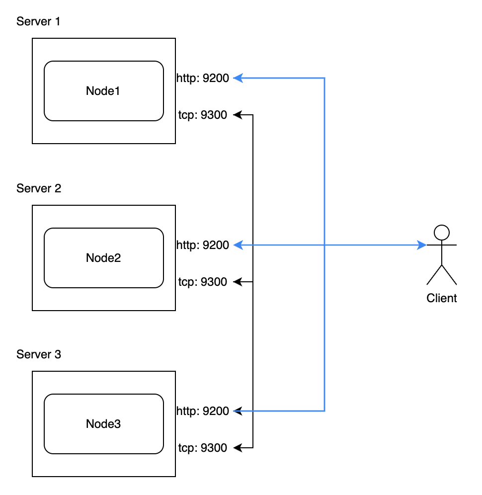
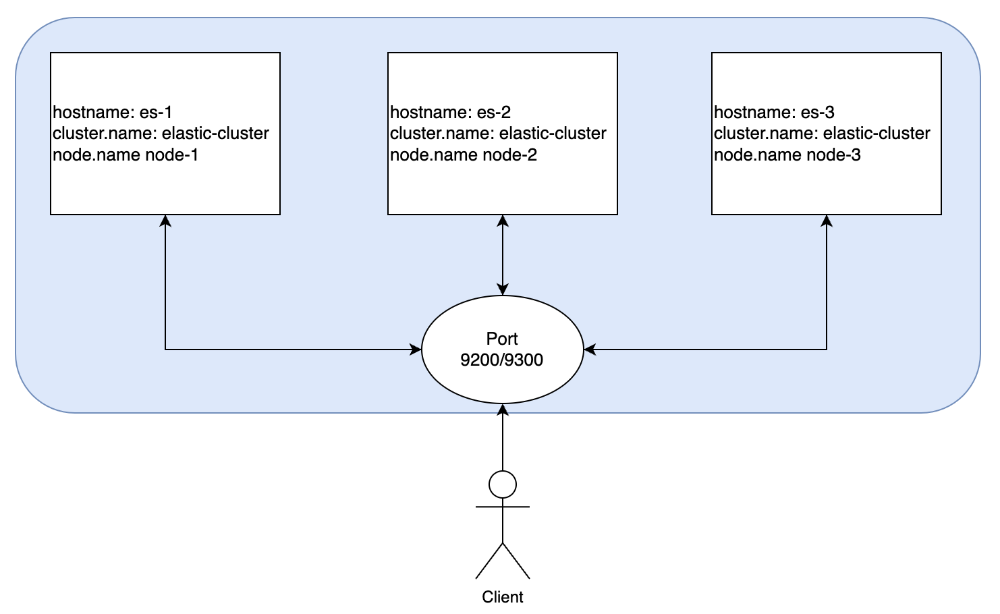

# ElasticSearch 설치

## ElasticSearch 설치

```bash
# ElasticSearch 다운로드
$ wget https://artifacts.elastic.co/downloads/elasticsearch/elasticsearch-7.10.2-linux-x86_64.tar.gz
$ tar -xvf elasticsearch-7.10.2-linux-x86_64.tar.gz

# ElasticSearch 실행
$ cd elasticsearch-7.10.2
$ bin/elasticsearch

# 실행 확인
$ curl -XGET localhost:9200
```

## elasticsearch.yaml 설정

 - cluster.name: 클러스터 이름 지정
 - node.name: 노드명 지정
 - path.data: 인덱스 경로 지정. 지정하지 않으면 data 디렉토리에 인덱스 생성
 - path.logs: 노드 및 클러스터 로그 저장 경로
 - bootstrap.memory_lock: 엘라스틱 서치가 잡은 heap 메모리를 다른 프로그램이 사용하지 못 하도록 lock
 - network.host: 지정된 IP만 엘라스틱서치에 접근할 수 있도록 설정
 - http.port: 클라이언트와 통신하는 HTTP 포트
 - transport.port: 내부 통신, 노드들 끼리 통신하는 포트
 - discovery.seed_hosts: 활성화된 다른 서버를 찾는 설정. 같은 클러스터로 묶인 노드의 IP, 도메인을 넣는다.
 - cluster.initial_master_nodes: 마스터 후보 노드 지정
```bash
$ cd config/
$ vi elasticsearch.yaml
cluster.name: elastic-cluster
node.name: node-1
```

## ElasticSearch 클러스터 구성

<div align="center">
    <br/>
    
</div>
<br/>

 - 호스트에 EC2의 프라이빗 주소 등록
```bash
# 3개의 인스턴스 모두 등록
$ sudo vi /etc/hosts
IP es-1
IP es-2
IP es-3
```

 - `config/elasticsearch.yaml`
```yml
cluster.name: elastic-cluster
node.name: node-1 # node-2, node-3
network.host: ["_local_","_site_"]
discovery.seed_hosts: ["es-1","es-2","es-3"]
cluster.initial_master_nodes: ["node-1", "node-2","node-3"]
```

 - `트러블 슈팅`
```bash
# max virtual memory areas vm.max_map_count [65530] is too low, increase to at least [262144] 에러 발생시
$ sudo vim /etc/sysctl.conf
vm.max_map_count=262144

$ sudo sysctl -p

# 모든 인스턴스 실행
$ bin/elasticsearch

# 통신 확인
$ curl {IP}:9200/_cat/nodes
```
