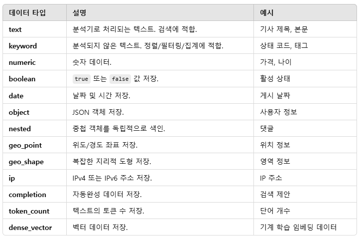

# ElasticSearch Mapping

## Mapping

ElasticSearch의 Mapping은 데이터가 어떻게 저장되고 검색될지를 정의하는 스키마를 설정하는 과정입니다. 관계형 데이터베이스의 스키마와 비슷한 역할을 하지만, ElasticSearch는 스키마리스 설계를 지원하기 때문에 특정 필드에 대한 스키마를 미리 정의하지 않아도 데이터를 저장할 수 있습니다.
 - type: 필드의 데이터 유형을 지정합니다. (예: text, keyword, integer, date 등)
 - analyzer: text 필드에 사용될 분석기를 지정합니다.
 - format: date 타입에서 날짜 형식을 지정합니다.
 - index: 필드의 색인 여부를 지정합니다. (기본값: true)
 - doc_values: 필드를 집계나 정렬에 사용할지를 결정합니다. (keyword와 같은 타입에서 주로 사용)
 - store: 필드를 _source 필드와 별도로 저장할지를 지정합니다.


 - `동적 매핑`
    - 데이터를 삽입할 때 자동으로 필드와 데이터 유형을 추론해 Mapping을 생성한다.
    - 데이터가 자주 변경되거나 구조를 미리 알 수 없을 때 유용
    - 예상치 못한 데이터 유형으로 매핑될 수 있음.
```json
PUT my_index/_doc/1
{
  "name": "John Doe",
  "age": 30,
  "registered_on": "2024-12-10"
}
```

 - `Explicit Mapping`
    - 특정 필드의 타입, 분석기 등을 미리 정의할 수 있다.
    - 검색 성능과 제어를 위해 사전에 정의가 필요함
```json
PUT my_index
{
  "mappings": {
    "properties": {
      "name": {
        "type": "text",
        "analyzer": "standard"
      },
      "age": {
        "type": "integer"
      },
      "registered_on": {
        "type": "date",
        "format": "yyyy-MM-dd"
      }
    }
  }
}
```

## Settings

ElasticSearch의 Settings은 인덱스의 설정을 정의하는 구성 요소로, 데이터 저장소의 동작과 성능을 제어합니다. Settings는 인덱스 생성 시 정의하거나, 일부 설정은 실행 중에 업데이트할 수 있습니다.

 - number_of_shards: 인덱스를 구성하는 기본 샤드의 개수
 - number_of_replicas: 각 샤드의 복제본(replica)의 개수
 - refresh_interval: 새로운 데이터가 검색 가능해지는 주기

```json
// 클러스터 레벨 세팅
PUT /_cluster/settings
{
  "persistent": {
    "cluster.routing.allocation.enable": "none"
  },
  "transient": {
    "cluster.routing.rebalance.enable": "all"
  }
}

// 인덱스 레벨 세팅
PUT /my_index
{
  "settings": {
    "number_of_shards": 3,
    "number_of_replicas": 1,
    "refresh_interval": "1s",
    "analysis": {
      "analyzer": {
        "custom_analyzer": {
          "type": "custom",
          "tokenizer": "standard",
          "filter": ["lowercase", "asciifolding"]
        }
      }
    }
  }
}
```

## 데이터 타입

<div align="center">
    
</div>

### 기본형

 - `Text`
    - 색인 시 분석기가 적용되어 토큰으로 나눠 저장됨.
    - 검색 시 match, query_string 쿼리를 사용.
```json
{
  "title": {
    "type": "text",
    "analyzer": "standard"
  }
}
```

 - `Keyword`
    - 정렬, 집계, 필터링, 정확한 값 비교에 적합.
    - 분석되지 않고 그대로 색인됨.
    - 검색 시 term 쿼리를 사용.
```json
{
  "status": {
    "type": "keyword"
  }
}
```

 - `Numeric Types`
    - 정수 및 부동소수점 숫자 저장.
    - long: 64비트 정수.
    - integer: 32비트 정수.
    - short: 16비트 정수.
    - byte: 8비트 정수.
    - double: 64비트 부동소수점.
    - float: 32비트 부동소수점.
```json
{
  "price": {
    "type": "double"
  }
}
```

 - `Boolean`
    - true 또는 false 값을 저장.
```json
{
  "is_active": {
    "type": "boolean"
  }
}
```

 - `Date`
    - 날짜 및 시간 저장.
    - 기본 형식: ISO 8601 (예: 2024-12-10T12:00:00Z).
    - format 옵션으로 사용자 정의 형식 가능.
```json
{
  "published_on": {
    "type": "date",
    "format": "yyyy-MM-dd HH:mm:ss"
  }
}
```

### 복합 데이터 타입

 - `Object`
    - JSON 객체 저장.
    - 각 속성은 독립적으로 색인됨.
    - 중첩 문서가 아닌 단순 객체 구조.
```json
{
  "user": {
    "type": "object",
    "properties": {
      "name": { "type": "text" },
      "age": { "type": "integer" }
    }
  }
}
```

 - `Nested`
    - 중첩된 JSON 객체를 저장하고, 관계형 데이터처럼 검색 가능.
    - nested 쿼리를 사용하여 개별적으로 쿼리 가능.
```json
{
  "comments": {
    "type": "nested",
    "properties": {
      "author": { "type": "text" },
      "message": { "type": "text" },
      "likes": { "type": "integer" }
    }
  }
}
```

### 지리 데이터 타입

 - `geo_point`
    - 위도와 경도를 저장하고, 거리 계산 및 지리적 쿼리에 사용
```json
{
  "location": {
    "type": "geo_point"
  }
}
```

 - `geo_shape`
    - 다각형, 선, 포인트 등 복잡한 지리적 데이터를 저장.
```json
{
  "area": {
    "type": "geo_shape"
  }
}
```

### 특수 데이터 타입

 - `IP`
    - IPv4 또는 IPv6 주소를 저장.
```json
{
  "ip_address": {
    "type": "ip"
  }
}
```

 - `Completion`
    - 자동완성을 위한 서제션 데이터 저장.
    - 효율적인 Prefix 검색 지원.
```json
{
  "suggest": {
    "type": "completion"
  }
}
```

 - `Token Count`
    - 텍스트 필드의 토큰 수를 저장.
```json
{
  "content_word_count": {
    "type": "token_count",
    "analyzer": "standard"
  }
}
```

 - `Dense Vector`
    - 기계 학습이나 추천 시스템에서 벡터 데이터를 저장.
```json
{
  "vector": {
    "type": "dense_vector",
    "dims": 128
  }
}
```
