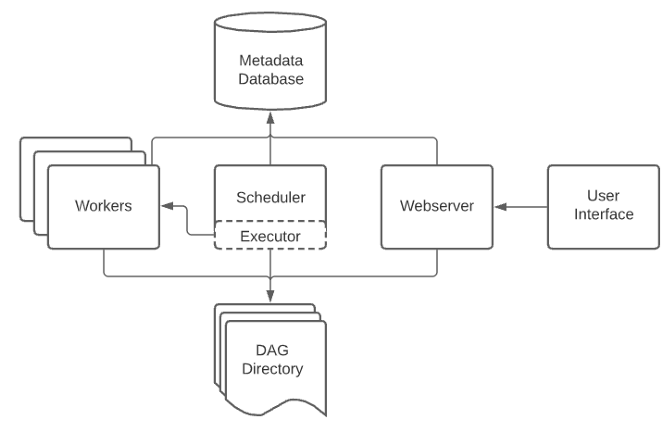
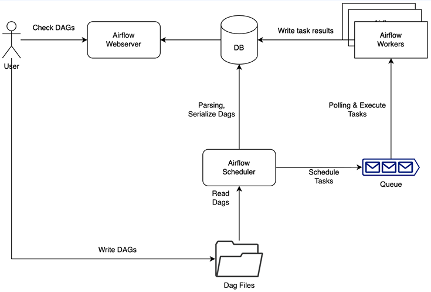
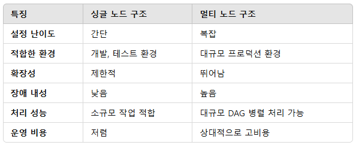
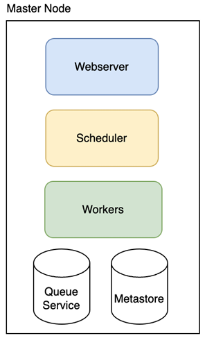
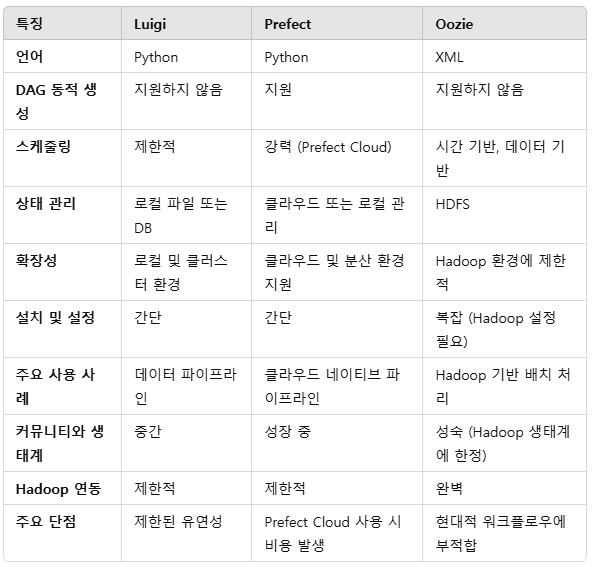

# Airflow

Apache Airflow는 워크플로우(workflow)나 파이프라인(pipeline)을 작성하고, 스케줄링하며, 모니터링할 수 있는 오픈 소스 플랫폼입니다. 데이터 엔지니어링 및 자동화 작업에서 널리 사용되며, 복잡한 데이터 파이프라인과 의존성을 효과적으로 관리할 수 있도록 도와줍니다.

 - Airbnb에서 2014년 10월에 시작된 오픈소스 프로젝트
 - __DAG (Directed Acyclic Graph)__
    - Airflow에서 워크플로우는 DAG로 표현됩니다. DAG는 비순환 유향 그래프로, 작업의 순서를 정의하고 의존성을 설정합니다.
 - __Task 기반 워크플로우__
    - 각 작업(Task)을 독립적으로 정의하며, 작업 간의 의존성을 설정해 워크플로우를 구성합니다.
    - 예: 데이터 추출 → 처리 → 저장.
 - __유연한 스케줄링__
    - cron 표현식이나 지정된 주기를 기반으로 작업을 실행할 수 있습니다.
    - 과거 데이터를 재처리하는 백필(backfill) 기능도 지원합니다.
 - __확장성과 분산 처리__
    - Celery, Dask, Kubernetes 등의 Executor를 통해 작업을 분산 실행할 수 있습니다.
    - 여러 워커(worker)를 통해 대규모 작업을 처리 가능.
 - __웹 기반 UI__
    - 작업의 상태를 모니터링하거나 DAG를 시각적으로 확인할 수 있는 웹 UI를 제공합니다.
    - 실행 이력, 로그, 에러 정보를 손쉽게 확인 가능.
 - __Python 코드 기반 워크플로우 정의__
    - 워크플로우 정의는 Python 스크립트로 작성됩니다.
    - 사용자가 커스텀 작업을 손쉽게 정의할 수 있습니다.
 - __플러그인 및 확장성__
    - 다양한 커넥터(예: MySQL, PostgreSQL, AWS, GCP 등)를 제공하며, 필요에 따라 플러그인을 추가할 수 있습니다.

## Airflow를 사용하는 이유

Airflow가 없다면 데이터를 불러오고, 일련의 처리를 하고, 저장을 하는 상황에서  각각의 스크립트를 실행해주어야 하고 작업 간의 의존성을 부여하기가 어렵다. 또한, 실행 시간과 실행 주기 설정을 직접해주어야 하며, 실제로 어떻게 처리되고 있는지에 대해서도 파악하기 힘들다. 이것을 DAG라는 그래프 방식으로 쉽게 보여주고 의존성을 붙일 수 있다.

 - Python을 통한 확장성
 - 개별 태스크들에 대해서 확인할 수 있고, 시간에 따른 파이프라인 상황 확인 가능
 - 로그를 확인하고 태스크를 관리 가능
 - 다양한 Operator 사용

## Airflow 구성 요소

 - __Scheduler__
    - DAG의 정의에 따라 작업을 스케줄링하고, 실행할 작업을 Executor에 전달합니다.
    - DAG들을 파싱해서 스케줄된 작업들의 작업 간격을 확인
    - 실제로 작업 명령을 워커(또는 큐)에 전달
    - DAG에 걸려있는 의존성을 확인하고 걸려있다면, 실행 큐에 더해줌
    - 스케줄러는 지정된 DAG 디렉토리의 모든 DAG를 모니터링
 - __Executor__
    - 작업을 실행하는 역할을 합니다. Celery, Local, Kubernetes 등 다양한 방식으로 실행할 수 있습니다.
 - __Metadata Database__
    - Airflow의 모든 메타데이터(예: DAG 상태, 작업 로그 등)를 저장합니다.
    - 일반적으로 MySQL, PostgreSQL 등이 사용됩니다.
 - __Worker__
    - 실제로 작업을 실행하는 프로세스입니다. 분산 처리 시 여러 워커가 병렬로 작업을 수행합니다.
    - 실제 운영 상에서는 큐 상태를 확인하고 큐가 밀린다면 워커들을 늘려서 지연을 해소
    - 큐에 들어있는 작업에 대해서 큐 파라미터명을 확인하고 작업을 할당, 실행
    - 특정 큐는 특정 워커에서 실행이 가능
 - __Web Server__
    - 작업 모니터링 및 관리 인터페이스를 제공하는 웹 UI입니다.
    - 파이프라인, DAG를 시각화해주고 사용자에게 메인 인터페이스를 제공한다.

<div align="center">
    <br/>
    
</div>
<br/>

## 싱글 노드 구조, 멀티 노드 구조

<div align="center">
    
</div>
<br/>

### 싱글 노드 구조

싱글 노드 구조는 모든 Airflow 구성 요소(Scheduler, Web Server, Metadata Database, Worker)가 하나의 서버에서 실행되는 구조입니다.

 - __장점__
    - 설정이 간단하고 빠르게 테스트 가능
    - 소규모 프로젝트 또는 개발/테스트 환경에 적합
 - __단점__
    - 확장성이 부족하며, 많은 작업이 병렬로 실행될 경우 병목 현상 발생
    - 하나의 서버에 모든 로드가 집중되므로 서버 장애 시 전체 서비스 중단

<div align="center">
    <br/>
    
</div>
<br/>

### 멀티 노드 구조

멀티 노드 구조는 Airflow의 각 구성 요소를 여러 서버로 분산하여 실행하는 구조입니다. 대규모 환경이나 안정성이 요구되는 프로덕션 환경에 적합합니다.

 - 워커에 오토스케일링 적용
 - 작업 부하가 커지면 워커를 스케일 아웃하여 처리, 부하가 줄어들면 스케일 인
 - 이 구조를 위해서 CeleryExecutor를 활성화해야 한다. 별도로 실행 중인 Worker Process가 Message Broker(Queue)로부터 Message를 전달받아 작업을 대신 수행해 주는 라이브러리
    - CeleryExecutor를 활성화하기 위해서는 Celery 백엔드 구성이 필요하다.
    - Redis, RabbitMQ 등을 이용
 - __장점__
    - 작업 처리 능력이 뛰어나고, 수평 확장이 가능
    - 대규모 DAG 및 병렬 작업 처리가 가능
    - 각 구성 요소가 독립적으로 작동하므로 장애 내성이 높음
 - __단점__
    - 설정과 관리가 복잡
    - 추가 인프라(예: Message Broker, 외부 DB 등)가 필요하여 비용 증가

## Airflow DAG

DAG(Directed Acyclic Graph)는 워크플로우를 정의하는 핵심 개념입니다. DAG는 작업(Task) 간의 실행 순서를 나타내며, 작업 간 의존 관계를 명확히 표현합니다.

 - DAG는 Directed Acyclic Graph의 약자로, 유향 비순환 그래프를 의미합니다.
 - Airflow에서 DAG는 워크플로우를 정의하고, 작업(Task) 간의 관계와 실행 순서를 나타냅니다.
 - DAG는 Python 코드로 작성되며, 작업(Task)을 구성하고 실행 스케줄을 정의합니다.

### DAG의 특징

 - __유향 그래프__
    - 작업(Task)은 방향성이 있는 의존 관계를 가집니다.
    - 예: 작업 A → 작업 B는 A가 완료된 후에 B가 실행됨을 의미합니다.
 - __비순환 그래프__
    - DAG는 **순환(cycle)**이 없어야 합니다.
    - 작업의 흐름이 순환하면 무한 루프가 발생할 수 있으므로 작업 간 순환은 금지됩니다.
 - __작업(Task)의 독립성__
    - DAG는 작업(Task) 자체의 실행 논리를 포함하지 않습니다. DAG는 단지 작업 간의 관계와 스케줄을 정의합니다.
 - __시간 기반 스케줄링__
    - DAG는 스케줄링 정보(예: 매일 오전 9시 실행)를 포함하여 자동으로 실행될 수 있도록 설정됩니다.

### DAG의 구성 요소

 - __Tasks__
    - DAG를 구성하는 개별 작업.
    - Task는 Operator(예: PythonOperator, BashOperator 등)를 사용하여 정의됩니다.
 - __Task Dependencies__
    - 작업 간의 의존 관계.
    - set_upstream 또는 set_downstream 메서드를 사용하거나, >>, << 연산자를 통해 설정할 수 있습니다.
 - __Operators__
    - Task가 수행할 작업의 유형을 정의합니다.
    - 예: PythonOperator(Python 함수 실행), BashOperator(쉘 명령 실행), DummyOperator(빈 작업).
 - __DAG Definition__
    - Python 코드를 통해 DAG 자체를 정의.
    - DAG의 이름, 스케줄링 간격, 시작 시간 등의 메타데이터 포함.

```python
from datetime import datetime
from airflow import DAG
from airflow.decorators import task
from airflow.operators.bash import BashOperator

with DAG(dag_id="demo", start_date=datetime(2022, 1, 1), schedule="0 0 * * *") as dag:
    # Tasks 정의
    hello = BashOperator(task_id="hello", bash_command="echo hello")

    # Decorator를 이용하여 Task 정의
    @task()
    def airflow():
        print("airflow")
    
    # 작업간의 의존 관계
    hello >> airflow()
```

 - `DAG 정의 방법`
    - with DAG와 Decorator를 이용한 방법이 있다.
    - dag_id: DAG의 고유 식별자
    - start_date: DAG의 시작 시간
    - schedule_interval: DAG의 실행 주기(@daily, @hourly, cron 표현식)
    - catchup: True일 경우, 백필(과거 실행)을 수행. False일 경우, 과거 실행 건을 무시.
    - default_args: DAG과 관련된 기본 설정. (예: owner, start_date, retries)
    - description: DAG에 대한 설명
```python
DAG(dag_id="my_dag", start_date=datetime.datetime(2021, 1, 1), schedule='@daily') as dag:
    EmptyOperator(task_id="task")

@dag(start_date=datetime.datetime(2021, 1, 1), schedule='@daily')
def generate_dag():
    EmptyOperator(task_id="task")

generate_dag()
```

## Airflow Operators

Operator는 DAG 내에서 작업(Task)을 수행하는 구성 요소입니다. Operator는 Airflow에서 제공하는 다양한 작업 유형을 정의하는 데 사용되며, 데이터 파이프라인에서 실행해야 할 작업의 구체적인 동작을 결정합니다.

 - Operator는 Airflow에서 Task를 정의하기 위해 사용되는 객체입니다.
 - Operator는 작업(Task)의 실행 논리를 캡슐화하며, 실제 작업을 수행하는 역할을 합니다.
 - DAG 안에서 Operator를 사용해 Task를 정의하고, 의존성을 설정하여 워크플로우를 구성합니다.

### Operator의 종류

Airflow는 다양한 내장 Operator를 제공하며, 필요에 따라 사용자 정의 Operator를 만들 수도 있습니다.

 - `Action Operator`
    - 특정 동작을 수행하는 Operator
```python
# PythonOperator: Python 함수 실행
from airflow.operators.python_operator import PythonOperator

def my_task():
    print("Executing Python function!")

task = PythonOperator(
    task_id='python_task',
    python_callable=my_task,
    dag=dag
)

# BashOperator: Bash 명령어 실행
from airflow.operators.bash_operator import BashOperator

task = BashOperator(
    task_id='bash_task',
    bash_command='echo "Hello, Airflow!"',
    dag=dag
)

# EmailOperator: 이메일 전송
from airflow.operators.email_operator import EmailOperator

task = EmailOperator(
    task_id='email_task',
    to='example@example.com',
    subject='Airflow Alert',
    html_content='<p>Hello!</p>',
    dag=dag
)
```

 - `Transfer Operator`
    - 데이터 전송 작업 수행
    - S3ToGCSOperator: AWS S3에서 Google Cloud Storage로 파일을 전송.
    - MySqlToPostgresOperator: MySQL에서 PostgreSQL로 데이터를 전송.
```python
# S3ToGCSOperator: Amazon S3에서 Google Cloud Storage(GCS)로 데이터를 전송
from airflow import DAG
from airflow.providers.amazon.aws.transfers.s3_to_gcs import S3ToGCSOperator
from datetime import datetime

with DAG(
    dag_id="s3_to_gcs_example",
    start_date=datetime(2023, 1, 1),
    schedule_interval=None,
    catchup=False
) as dag:

    transfer_task = S3ToGCSOperator(
        task_id="transfer_s3_to_gcs",
        bucket_name="my_s3_bucket",  # S3 버킷 이름
        prefix="data/",             # 전송할 S3의 디렉토리(prefix)
        dest_gcs="gs://my-gcs-bucket/data",  # GCS의 목적지 경로
        aws_conn_id="my_aws_conn",  # AWS 연결 ID (Airflow 설정에 등록)
        gcp_conn_id="my_gcp_conn"   # GCP 연결 ID (Airflow 설정에 등록)
    )

# MySqlToPostgresOperator: MySQL에서 PostgreSQL로 데이터를 전송
from airflow import DAG
from airflow.providers.mysql.transfers.mysql_to_postgres import MySqlToPostgresOperator
from datetime import datetime

with DAG(
    dag_id="mysql_to_postgres_example",
    start_date=datetime(2023, 1, 1),
    schedule_interval=None,
    catchup=False
) as dag:

    transfer_task = MySqlToPostgresOperator(
        task_id="transfer_mysql_to_postgres",
        sql="SELECT * FROM my_table",  # MySQL에서 실행할 쿼리
        source_mysql_conn_id="mysql_conn",  # MySQL 연결 ID
        target_postgres_conn_id="postgres_conn"  # PostgreSQL 연결 ID
    )

# LocalFilesystemToS3Operator: 로컬 파일 시스템에서 Amazon S3로 파일을 업로드
from airflow import DAG
from airflow.providers.amazon.aws.transfers.local_to_s3 import LocalFilesystemToS3Operator
from datetime import datetime

with DAG(
    dag_id="local_to_s3_example",
    start_date=datetime(2023, 1, 1),
    schedule_interval=None,
    catchup=False
) as dag:

    transfer_task = LocalFilesystemToS3Operator(
        task_id="transfer_local_to_s3",
        filename="/path/to/my_file.csv",  # 로컬 파일 경로
        dest_key="data/my_file.csv",     # S3 내 목적지 경로
        dest_bucket="my_s3_bucket",     # S3 버킷 이름
        aws_conn_id="aws_conn"          # AWS 연결 ID
    )

```

 - `Sensor Operator`
    - 특정 조건이 충족될 때까지 대기하는 작업을 수행
    - 이벤트 기반 작업에 사용
    - ExternalTaskSensor: 다른 DAG의 작업이 완료될 때까지 대기
```python
# FileSensor: 특정 파일이 나타날 때까지 대기
from airflow.sensors.filesystem import FileSensor

task = FileSensor(
    task_id='file_sensor_task',
    filepath='/path/to/file',
    poke_interval=10,  # 10초마다 파일 존재 여부 확인
    timeout=300,       # 최대 5분 대기
    dag=dag
)
```

 - `Big Data Operator`
    - SparkSubmitOperator: Spark 애플리케이션을 제출
    - HiveOperator: Hive 쿼리를 실행
    - PostgresOperator: PostgreSQL 쿼리를 실행
```python
# PostgresOperator: PostgreSQL 쿼리를 실행
from airflow.providers.postgres.operators.postgres import PostgresOperator

task = PostgresOperator(
    task_id='postgres_task',
    sql='SELECT * FROM my_table;',
    postgres_conn_id='my_postgres_conn',
    dag=dag
)
```

### Custom Operator

Airflow는 내장된 Operator 외에도 사용자가 필요에 따라 커스텀 Operator를 정의할 수 있습니다.

```python
from airflow.models.baseoperator import BaseOperator

class MyCustomOperator(BaseOperator):
    def __init__(self, my_param, *args, **kwargs):
        super().__init__(*args, **kwargs)
        self.my_param = my_param

    def execute(self, context):
        print(f"My custom parameter: {self.my_param}")

# 사용 예시
task = MyCustomOperator(
    task_id='custom_task',
    my_param='Hello, Custom Operator!',
    dag=dag
)
```

### AWS EMR Operators

AWS EMR Operators는 Apache Airflow에서 AWS EMR (Elastic MapReduce) 작업을 관리하고 실행하기 위해 제공되는 Operator들입니다. EMR은 대규모 데이터를 처리하고 분석하기 위한 클라우드 기반 분산 컴퓨팅 서비스이며, Airflow의 EMR Operators는 EMR 클러스터를 생성, 관리 및 작업(Job)을 실행하는 기능을 제공합니다.

 - __클러스터 관리__: EMR 클러스터 생성, 수정, 종료를 자동화
 - __작업(Job) 관리__: Hadoop, Spark, Hive, Pig 등과 같은 작업을 클러스터에서 실행
 - __상태 모니터링__: EMR 클러스터 및 작업의 상태를 Airflow DAG에서 모니터링 가능
 - __종속성 관리__: Airflow DAG 내 다른 작업과 의존성을 설정하여 워크플로우를 구성

 - `EMRCreateJobFlowOperator`
    - 새로운 EMR 클러스터(Job Flow)를 생성합니다.
    - 사용자가 정의한 구성을 기반으로 클러스터를 시작
```python
from airflow import DAG
from airflow.providers.amazon.aws.operators.emr import EMRCreateJobFlowOperator
from datetime import datetime

JOB_FLOW_OVERRIDES = {
    "Name": "example-emr-cluster",
    "ReleaseLabel": "emr-6.3.0",
    "Instances": {
        "InstanceGroups": [
            {
                "Name": "Master node",
                "Market": "SPOT",
                "InstanceRole": "MASTER",
                "InstanceType": "m5.xlarge",
                "InstanceCount": 1,
            },
            {
                "Name": "Core nodes",
                "Market": "SPOT",
                "InstanceRole": "CORE",
                "InstanceType": "m5.xlarge",
                "InstanceCount": 2,
            },
        ],
    },
    "Applications": [{"Name": "Spark"}],
}

with DAG(
    dag_id="example_emr_create_cluster",
    start_date=datetime(2023, 1, 1),
    schedule_interval=None,
    catchup=False,
) as dag:

    create_cluster = EMRCreateJobFlowOperator(
        task_id="create_emr_cluster",
        job_flow_overrides=JOB_FLOW_OVERRIDES,  # 클러스터 구성
        aws_conn_id="aws_default",             # Airflow 연결 ID
    )

```

 - `EMRTerminateJobFlowOperator`
    - 기존 EMR 클러스터를 종료합니다.
```python
from airflow.providers.amazon.aws.operators.emr import EMRTerminateJobFlowOperator

terminate_cluster = EMRTerminateJobFlowOperator(
    task_id="terminate_emr_cluster",
    job_flow_id="{{ task_instance.xcom_pull(task_ids='create_emr_cluster', key='return_value') }}",  # 생성된 클러스터 ID
    aws_conn_id="aws_default",
    dag=dag,
)
```

 - `EMRAddStepsOperator`
    - 기존 EMR 클러스터에서 작업(Step)을 실행합니다.
    - 작업은 Spark, Hadoop, Hive 등으로 정의 가능합니다.
```python
from airflow.providers.amazon.aws.operators.emr import EMRAddStepsOperator

SPARK_STEPS = [
    {
        "Name": "example_spark_step",
        "ActionOnFailure": "CONTINUE",
        "HadoopJarStep": {
            "Jar": "command-runner.jar",
            "Args": ["spark-submit", "--deploy-mode", "cluster", "s3://path-to-your-script.py"],
        },
    }
]

add_steps = EMRAddStepsOperator(
    task_id="add_spark_steps",
    job_flow_id="{{ task_instance.xcom_pull(task_ids='create_emr_cluster', key='return_value') }}",  # 클러스터 ID
    steps=SPARK_STEPS,
    aws_conn_id="aws_default",
    dag=dag,
)
```

 - `EMRStepSensor`
    - EMR 작업(Step)이 완료될 때까지 대기합니다.
```python
from airflow.providers.amazon.aws.sensors.emr import EMRStepSensor

wait_for_step = EMRStepSensor(
    task_id="wait_for_spark_step",
    job_flow_id="{{ task_instance.xcom_pull(task_ids='create_emr_cluster', key='return_value') }}",
    step_id="{{ task_instance.xcom_pull(task_ids='add_spark_steps', key='return_value')[0] }}",
    aws_conn_id="aws_default",
    dag=dag,
)
```

 - `EMRModifyClusterOperator`
    - 실행 중인 EMR 클러스터의 구성을 수정합니다.
    - 예: 노드 수를 늘리거나 줄이는 작업.
```python
from airflow.providers.amazon.aws.operators.emr import EMRModifyClusterOperator

modify_cluster = EMRModifyClusterOperator(
    task_id="modify_emr_cluster",
    cluster_id="{{ task_instance.xcom_pull(task_ids='create_emr_cluster', key='return_value') }}",
    step_concurrency_level=5,  # 최대 동시 실행 스텝 수
    aws_conn_id="aws_default",
    dag=dag,
)
```

#### DAG로 연결된 AWS EMR 워크플로우 예쩨

```python
from airflow import DAG
from airflow.providers.amazon.aws.operators.emr import EMRCreateJobFlowOperator, EMRAddStepsOperator, EMRTerminateJobFlowOperator
from airflow.providers.amazon.aws.sensors.emr import EMRStepSensor
from datetime import datetime

JOB_FLOW_OVERRIDES = {
    "Name": "example-emr-cluster",
    "ReleaseLabel": "emr-6.3.0",
    "Instances": {
        "InstanceGroups": [
            {
                "Name": "Master node",
                "Market": "SPOT",
                "InstanceRole": "MASTER",
                "InstanceType": "m5.xlarge",
                "InstanceCount": 1,
            },
            {
                "Name": "Core nodes",
                "Market": "SPOT",
                "InstanceRole": "CORE",
                "InstanceType": "m5.xlarge",
                "InstanceCount": 2,
            },
        ],
    },
    "Applications": [{"Name": "Spark"}],
}

SPARK_STEPS = [
    {
        "Name": "example_spark_step",
        "ActionOnFailure": "CONTINUE",
        "HadoopJarStep": {
            "Jar": "command-runner.jar",
            "Args": ["spark-submit", "--deploy-mode", "cluster", "s3://path-to-your-script.py"],
        },
    }
]

with DAG(
    dag_id="example_emr_workflow",
    start_date=datetime(2023, 1, 1),
    schedule_interval=None,
    catchup=False,
) as dag:

    create_cluster = EMRCreateJobFlowOperator(
        task_id="create_emr_cluster",
        job_flow_overrides=JOB_FLOW_OVERRIDES,
        aws_conn_id="aws_default",
    )

    add_steps = EMRAddStepsOperator(
        task_id="add_spark_steps",
        job_flow_id="{{ task_instance.xcom_pull(task_ids='create_emr_cluster', key='return_value') }}",
        steps=SPARK_STEPS,
        aws_conn_id="aws_default",
    )

    wait_for_step = EMRStepSensor(
        task_id="wait_for_spark_step",
        job_flow_id="{{ task_instance.xcom_pull(task_ids='create_emr_cluster', key='return_value') }}",
        step_id="{{ task_instance.xcom_pull(task_ids='add_spark_steps', key='return_value')[0] }}",
        aws_conn_id="aws_default",
    )

    terminate_cluster = EMRTerminateJobFlowOperator(
        task_id="terminate_emr_cluster",
        job_flow_id="{{ task_instance.xcom_pull(task_ids='create_emr_cluster', key='return_value') }}",
        aws_conn_id="aws_default",
    )

    create_cluster >> add_steps >> wait_for_step >> terminate_cluster
```

### KubernetesPodOperator


**KubernetesPodOperator**는 Apache Airflow에서 제공하는 Operator로, Kubernetes 클러스터에서 Pod를 실행하기 위해 사용됩니다. 이 Operator를 사용하면 Airflow DAG 내에서 Kubernetes의 강력한 컨테이너 오케스트레이션 기능을 활용할 수 있습니다.

 - **KubernetesPodOperator**는 Airflow의 작업(Task)을 Kubernetes Pod에서 실행할 수 있도록 지원합니다.
 - 작업이 실행될 컨테이너 이미지, 리소스 요구사항, 환경 변수를 지정하고 Kubernetes에서 관리됩니다.
 - 데이터 파이프라인을 컨테이너 기반으로 실행해야 하는 경우 유용합니다.
 - __컨테이너화된 작업 실행__: Docker 이미지 기반으로 작업을 정의하고 실행. 다양한 프로그래밍 언어 및 라이브러리를 사용할 수 있음.
 - __리소스 관리__: CPU, 메모리 등의 리소스 요청 및 제한 설정 가능
 - __환경 변수 및 볼륨 지원__: 작업에서 사용할 환경 변수 설정. ConfigMap 및 Secret을 통해 보안 및 환경 설정 지원.
 - __분리된 환경__: 각 작업은 Kubernetes Pod 내에서 독립적으로 실행되므로 작업 간 충돌 방지
 - __Kubernetes 네이티브 기능__: 노드 선택, 테인트/톨러레이션, 네임스페이스, 네트워크 정책 등 Kubernetes의 다양한 기능 활용 가능
 - __확장성__: Kubernetes의 확장성과 분산 처리 능력을 Airflow와 통합

#### KubernetesPodOperator의 주요 매개변수

 - namespace: Pod가 실행될 Kubernetes 네임스페이스
 - image: 실행할 Docker 컨테이너 이미지
 - name: 생성될 Pod의 이름
 - env_vars: 환경 변수 설정
 - resources: Pod에 할당할 CPU 및 메모리 요청/제한
 - volumes, volume_mounts: Kubernetes 볼륨 및 마운트 설정
 - labels: Pod에 적용할 Kubernetes 라벨
 - node_selector: 특정 노드에서 Pod를 실행하기 위한 조건
 - tolerations: Pod가 특정 노드의 테인트를 허용하도록 설정

#### KubernetesPodOperator 사용 예제

 - `간단한 Pod 실행`
```python
from airflow import DAG
from airflow.providers.cncf.kubernetes.operators.kubernetes_pod import KubernetesPodOperator
from datetime import datetime

with DAG(
    dag_id="example_kubernetes_pod_operator",
    start_date=datetime(2023, 1, 1),
    schedule_interval=None,
    catchup=False,
) as dag:

    k8s_task = KubernetesPodOperator(
        task_id="run_ubuntu_pod",
        namespace="default",                # Kubernetes 네임스페이스
        name="ubuntu-task",                 # Pod 이름
        image="ubuntu:latest",              # Docker 이미지
        cmds=["bash", "-c"],                # 실행 명령어
        arguments=["echo 'Hello, Airflow!'"],  # 실행 인자
        is_delete_operator_pod=True,        # 작업 완료 후 Pod 삭제
    )
```

 - `환경 변수와 리소스 설정`
    - 환경 변수를 설정하고, CPU와 메모리 리소스를 요청/제한
```python
k8s_task = KubernetesPodOperator(
    task_id="run_with_env_and_resources",
    namespace="default",
    name="resource-task",
    image="python:3.8-slim",
    cmds=["python", "-c"],
    arguments=[
        "import os; print(f'Hello, {os.getenv('NAME', 'World')}!')"
    ],
    env_vars={
        "NAME": "Airflow",  # 환경 변수 설정
    },
    resources={
        "request_cpu": "500m",  # 최소 0.5 vCPU 요청
        "limit_cpu": "1",       # 최대 1 vCPU 사용
        "request_memory": "128Mi",  # 최소 128MiB 메모리 요청
        "limit_memory": "256Mi",    # 최대 256MiB 메모리 사용
    },
    is_delete_operator_pod=True,
)
```

 - `ConfigMap 및 Secret 사용`
    - Pod 실행 시 Kubernetes ConfigMap과 Secret을 마운트하거나 환경 변수로 전달
```python
k8s_task = KubernetesPodOperator(
    task_id="run_with_config_and_secret",
    namespace="default",
    name="config-secret-task",
    image="python:3.8-slim",
    cmds=["python", "-c"],
    arguments=[
        "import os; print(f'Config value: {os.getenv('CONFIG_KEY')}, Secret value: {os.getenv('SECRET_KEY')}')"
    ],
    env_from=[
        {
            "config_map_ref": {
                "name": "my-config-map",  # ConfigMap 참조
            }
        },
        {
            "secret_ref": {
                "name": "my-secret",  # Secret 참조
            }
        }
    ],
    is_delete_operator_pod=True,
)
```

 - `볼륨 및 노드 선택`
    - Kubernetes 볼륨을 마운트하거나 특정 노드에서 Pod를 실행하도록 설정
```python
k8s_task = KubernetesPodOperator(
    task_id="run_with_volume_and_node",
    namespace="default",
    name="volume-task",
    image="alpine:latest",
    cmds=["cat", "/mnt/data/example.txt"],
    volumes=[
        {
            "name": "data-volume",
            "persistent_volume_claim": {
                "claim_name": "my-pvc",  # PVC 이름
            }
        }
    ],
    volume_mounts=[
        {
            "name": "data-volume",
            "mount_path": "/mnt/data",  # 컨테이너 내 마운트 경로
        }
    ],
    node_selector={"kubernetes.io/hostname": "specific-node"},  # 특정 노드 선택
    is_delete_operator_pod=True,
)
```
 
## Cloud Managed Service of Airflow


Cloud Managed Service for Apache Airflow는 클라우드 제공자가 Airflow 환경을 관리형 서비스로 제공하는 것을 의미합니다. 이 서비스를 사용하면 사용자들이 Airflow의 설정, 운영, 및 유지 관리를 클라우드 플랫폼에 맡기고 데이터 파이프라인을 구성, 실행 및 모니터링하는 데 집중할 수 있습니다.

 - __운영 관리 간소화__: 클러스터 설정, 업그레이드, 장애 복구 등의 작업이 클라우드 제공자에 의해 자동으로 관리됩니다.
 - __확장성__: 필요에 따라 컴퓨팅 리소스를 자동으로 확장/축소하여 효율성을 최적화
 - __보안__: 클라우드 제공자의 네트워크 보안, IAM(Identity and Access Management), 데이터 암호화 정책을 활용
 - __비용 절감__: 온프레미스에서 직접 Airflow를 설정하고 운영할 때 드는 인프라 및 운영 비용 절감
 - __클라우드 통합__: 클라우드 제공자가 제공하는 데이터 스토리지, 분석, AI/ML 등과 쉽게 통합 가능

### Google Cloud Composer

 - Google Cloud에서 제공하는 Apache Airflow 기반의 관리형 서비스
 - Google Cloud Composer는 GCP 리소스와의 통합에 최적화되어 있습니다.
 - GKE(Google Kubernetes Engine) 위에 Airflow 클러스터 배포
 - BigQuery, Cloud Storage, Pub/Sub, Dataflow 등 GCP 서비스와 완벽히 통합
 - Auto-scaling 지원으로 리소스 최적화
 - Cloud Identity를 통한 보안 관리

### Amazon Managed Workflows for Apache Airflow (MWAA)

 - AWS에서 제공하는 관리형 Apache Airflow 서비스
 - S3, EMR, Redshift, Glue 등 AWS 서비스와의 통합이 용이
 - S3 버킷을 사용해 DAG 및 플러그인을 관리
 - AWS IAM을 통해 작업 보안과 권한 관리
 - CloudWatch를 통해 로깅 및 모니터링 지원
 - VPC 내 배포로 네트워크 보안 강화

### Azure Data Factory Managed Apache Airflow

 - Azure의 Data Factory에서 관리형 Airflow 환경을 제공합니다.
 - Azure Synapse, Blob Storage, Azure ML 등과 통합 가능
 - Azure Data Factory 내에서 Apache Airflow 환경을 관리
 - Azure Monitor를 통해 작업 상태와 성능 모니터링
 - Azure Key Vault를 통한 비밀 관리
 - Azure Active Directory(AAD) 통합으로 보안 강화

## Luigi, Prefect, Oozie

### Luigi

Luigi는 Spotify에서 개발한 Python 기반 데이터 파이프라인 관리 도구입니다. DAG(Directed Acyclic Graph)를 정의하고, 작업 간의 의존성을 관리하는 데 사용됩니다.
 - __Pythonic Interface__
    - Python 코드를 사용해 워크플로우를 정의.
    - Task 클래스를 상속받아 작업을 구현하고, 작업 간 의존성을 정의.
 - __로컬 및 클러스터 실행__
    - 로컬에서 실행하거나, Hadoop YARN 클러스터 환경에서 동작 가능.
 - __상태 관리__
    - 작업의 상태(완료, 실패, 진행 중 등)를 로컬 파일 시스템 또는 RDBMS에 저장.
 - __스케줄링 및 재시도__
    - 실패한 작업을 재시도하며 의존성을 유지.

### Prefect

Prefect는 현대적인 데이터 워크플로우를 지원하기 위해 설계된 Python 기반 오케스트레이션 도구입니다. Luigi와 유사하지만, 유연성과 확장성에 중점을 둔 도구로, cloud-native 환경과 잘 통합됩니다.

 - Dynamic DAG
    - 실행 중에 DAG를 동적으로 생성하거나 수정 가능.
 - Pythonic Interface
    - Python 코드를 사용하여 워크플로우 정의.
    - 데코레이터(@task, @flow)를 사용하여 작업을 손쉽게 정의.
 - State Management
    - Prefect는 각 작업(Task)의 상태를 클라우드 또는 로컬에서 관리.
 - Cloud Integration
    - Prefect Cloud를 통해 중앙에서 작업을 모니터링하고 관리.
    - 클라우드에서 대시보드를 제공하여 작업 실행 상태를 시각화.
 - 직관적인 에러 핸들링
    - 작업 실패에 대해 조건부 실행 및 사용자 정의 재시도 로직 설정 가능.

### Oozie

Apache Oozie는 Hadoop 기반 워크플로우 관리 도구로, 주로 배치 작업과 데이터 처리 파이프라인에 사용됩니다. XML로 워크플로우를 정의하며, Hadoop 환경과 긴밀히 통합되어 있습니다.

 - __Hadoop Integration__
    - MapReduce, Spark, Hive, Pig 작업을 지원.
    - HDFS와 긴밀히 연동.
 - __Workflow Scheduling__
    - 시간 기반 및 데이터 기반의 스케줄링 지원.
 - __복잡한 워크플로우 지원__
    - 작업 간 조건부 흐름(예: 성공, 실패 시 분기)을 정의 가능.
 - __Extensibility__
    - Java Action을 사용하여 사용자 정의 작업을 추가할 수 있음.

### 요약

 - Luigi:
    - 장점: 간단한 Python 기반 워크플로우 정의, 소규모 배치 처리에 적합.
    - 적합한 환경: 로컬 또는 간단한 클러스터 환경에서 Python으로 데이터 파이프라인을 관리하고자 할 때.
 - Prefect:
    - 장점: 클라우드 네이티브, 동적 DAG 생성, 유연한 상태 관리.
    - 적합한 환경: 클라우드 환경에서 동적이고 복잡한 데이터 워크플로우를 필요로 할 때.
 - Oozie:
    - 장점: Hadoop 기반 배치 처리와 강력한 통합.
    - 적합한 환경: 기존 Hadoop 환경에서 배치 작업 및 파이프라인을 관리하고자 할 때.

<div align="center">
    
</div>
