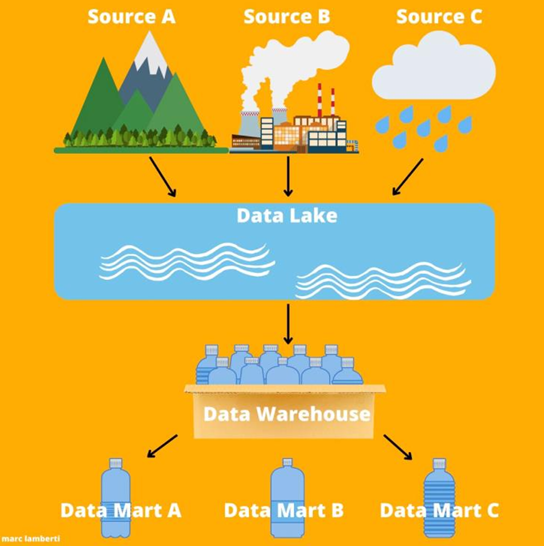
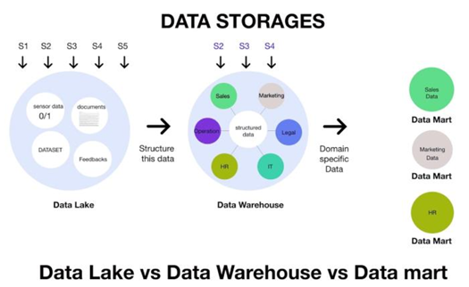
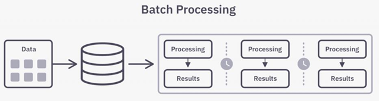
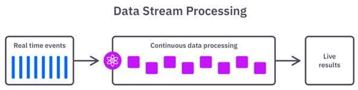
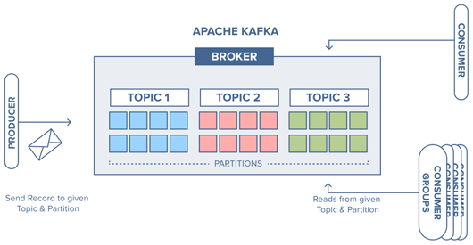
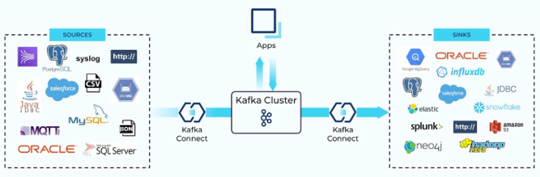
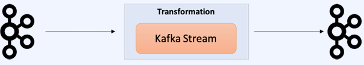
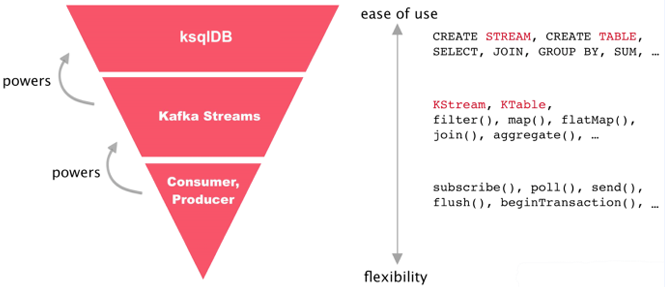

# 데이터 파이프라인 기본 개념

## 1. 데이터 파이프라인

다양한 데이터 소스에서 원시 데이터(Raw Data)를 수집한 다음 분석을 위해 데이터레이크(Data Lake) 또는 데이터 웨어 하우스(Data Warehouse)와 같은 데이터 저장소로 이전하는 방법을 의미한다.

 - 프로세스: 수집 > 처리 > 저장 > 분석 > 활용 > 거버넌스&모니터링
 - ETL/ELT, Data Lake, Data Warehouse, Data Marts, BI/Analytics
 - Data Lake
    - 호수, 물이 모여 있는 곳
    - 여러가지 데이터가 모여 있는 곳
 - Data Warehouse
    - PET병을 모아두는 창고
    - 데이터를 정재해서 모아두는 곳
 - Data Mart
    - 물이 담긴 하나의 PET병
    - 목적별 데이터

     
    

 

## 2. 모던 데이터 엔지니어링 아키텍처

### 확장 가능한 데이터 레이크

데이터 레이크를 설정하고 관리하기 위해서는 시간 소모적인 수작업이 필요하다. AWS Lake Formation은 이러한 작업을 자동화하므로 사용자는 몇 달이 아니라 며칠 만에 데이터 레이크를 구축하고 보호할 수 있다. 데이터 레이크 스토리지의 경우, Amazon S3는 독보적인 99.99999%의 내구성과 99.99%의 가용성 덕분에 데이터 레이크를 구축하기에 가장 적합하며, 객체 수준 감사 로깅 및 액세스 제어를 통한 최상의 보안, 규정 준수, 감사 기능을 제공하고, 5개의 스토리지 계층으로 최고의 유연성을 보여주며, 요금이 저렴하다.

 - Amazon Simple Storage Service(S3): 어디서나 원하는 양의 데이터를 저장하고 검색할 수 있도록 구축된 객체 스토리지
 - AWS Lake Formation: 데이터 레이크
 - Amazon Athena: 표준 SQL을 사용하여 데이터 레이크에 저장된 데이터 쿼리 및 분석
 - AWS Glue: 분석, 기계 학습 및 애플리케이션 개발을 위한 서버리스 데이터 통합 서비스

### 목적별 분석 서비스

AWS는 고유한 분석 사용 사례에 최적화된 가장 광범위하고 가장 심층적인 목적별 분석 서비스 포트폴리오를 제공한다.

Amazon Redshift는 다른 클라우드 데이터웨어 하우스보다 3배 더 빠르고 50% 이상 저렴하다. Spark on Amazon EMR은 표준 Apache Spark 3.0보다 1.7배 빠르게 실행되며 기존 온프레미스 솔루션의 절반도 안 되는 비용으로 페타바이트 규모의 분석을 실행할 수 있다.

 - Amazon Athena: 표준 SQL을 사용하여 데이터 레이크에 저장된 데이터 쿼리 및 분석
 - Amazon EMR: Apache Spark, Hive,  Presto 및 기타 빅 데이터 프레임워크와 같은 오픈 소스 프레임워크를 사용하여 빅 데이터를 처리하는 업계 최고의 클라우드 빅 데이터 플랫폼
 - Amazon OpenSearch Service: 대화형 로그 분석, 실시간 애플리케이션 모니터링 및 웹사이트 검색 등을 쉽게 수행할 수 있게 해준다.
 - Amazon Kinesis: 비디오 및 데이터 스트림을 실시간으로 수집, 처리 및 분석
 - Amazon Redshift: 클라우드 데이터 웨어하우스로 페타바이트 규모의 정형 데이터에 대해 복잡한 분석 쿼리를 실행

### 통합 데이터 액세스

데이터 레이크 및 목적별 데이터 스토어의 데이터가 증가하면서, 해당 데이터 일부를 한 데이터 스토어에서 다른 데이터 스토어로 쉽게 이동하는 기능이 필요한 경우가 많다.

AWS를 사용하면 여러 데이터 스토어와 데이터 레이크에서 데이터를 손쉽게 결합, 이동 및 복제할 수 있다. AWS Glue는 분석, 기계 학습, 애플리케이션 개발을 위해 데이터를 손쉽게 검색, 준비 및 결합할 수 있는 포괄적인 데이터 통합 기능을 제공하는 한편, Amazon Redshift는 S3 데이터 레이크에서 데이터를 쉽게 쿼리할 수 있다.

 - AWS Glue: 분석, 기계 학습 및 애플리케이션 개발을 위한 서버리스 데이터 통합 서비스
 - Amazone Kinesis Data Firehose: 실시간 데이터 스트림을 준비하여 데이터 스토어 및 분석 서비스로 로드

### 통합 거버넌스

최신 분석 아키텍처에서 가장 중요한 부분 중 하나는 고객이 데이터에 대한 액세스 권한을 부여, 관리 및 감사하는 기능이다.

AWS는 여러 데이터 레이크와 목적별 데이터 스토어에 걸쳐 모든 데이터에 대한 액세스를 한 곳에서 관리할 수 있는 거버넌스 기능을 제공한다. AWS Lake Formation을 사용하면 보안, 거버넌스 및 감사 정책을 한 곳에서 정의하고 관리할 수 있으므로 전사적 데이터 공유를 위한 일관된 액세스 제어가 가능하다.

 - AWS Lake Formation

## 3. 배치 파이프라인과 관련 기술

### 일괄 처리

이름에서 알 수 있듯이, 일괄 처리는 미리 설정된 시간 간격 동안 저장소에 데이터의 "묶음(batch)"을 로드하며, 일반적으로 사용량이 적은 업무 시간에 예약됩니다. 이렇게 하면 대용량 데이터에 대한 작업으로 전체 시스템에 부담을 줄 수 있는 일괄 처리 작업이 다른 워크로드에 미치는 영향을 최소화할 수 있습니다.

일괄 처리는 보통 특정 데이터 세트(예: 월별 회계)를 즉시 분석할 필요가 없을 때 최적의 데이터 파이프라인이며, "추출, 변환, 로드"를 의미하는 ETL 데이터 통합 프로세스와 더 관련이 있습니다.

일괄 처리 작업은 한 명령의 출력이 다른 명령의 입력이 되는 순차적인 명령의 워크플로우를 형성합니다. 예를 들어, 한 명령이 데이터 수집을 시작하면 다음 명령이 특정 열의 필터링을 트리거하고, 그다음 명령은 집계를 처리할 수 있습니다. 이 일련의 명령은 데이터가 완전히 변환되어 데이터 저장소에 기록될 때까지 계속됩니다.

    

 - 사용 사례: 지난 1시간 검색어 순위(배민), 특정 기간 동안 Top 10(넷플릭스), 월별 통계
 - 관련 기술 및 툴: Amazon S3, Amazon EMR, Amazon Managed Workflows, Hadoop(HDFS, Map Reduce), Apache Spark, Apache SQOOP, Airflow 등
 - `Amazon Relational Database Service(RDS)`
    - 클라우드에서 관계형 데이터베이스를 쉽게 설정, 운영 및 확장할 수 있는 관리형 서비스입니다.
    - 시간 소모적인 데이터베이스 관리 작업을 처리하는 한편, 비용 효율적이고 크기를 조정할 수 있는 용량을 제공합니다. 이를 통해 고객은 애플리케이션과 비즈니스에 좀 더 집중할 수 있습니다.
    - 지원되는 데이터베이스: MySQL, MariaDB, Oracle, SQL Server, PostgreSQL
 - `Hadoop File System (HDFS)`
    - 구글 파일 시스템을 본떠 오픈소스로 만들어진 분산 파일 시스템입니다.
    - 하나의 디스크나 노드의 제약을 뛰어넘기 위해, 클러스터의 각 노드는 완전한 파일 시스템의 일부 데이터만을 저장하며, 언제든지 노드를 추가하여 전체 파일 시스템 크기를 키울 수 있도록 설계되었습니다.
    - 대용량 데이터를 저장할 수 있으며, 데이터 무결성을 보장합니다.
    - 단점으로는 append-only 특징, low-latency 데이터 접근, small file 문제 등이 있습니다.
 - `Apache Spark`
    - 빅데이터 워크로드에 주로 사용되는 오픈소스 분산 처리 시스템입니다.
    - 대용량 데이터를 저장 및 처리하거나, 비정형 데이터를 변환하거나, 스트리밍 데이터를 처리해야 하는 다양한 케이스에서 활용할 수 있는 범용 분산 처리 엔진입니다.
    - 빠른 성능을 위해 인메모리 캐싱과 최적화된 실행 방식을 사용합니다.
    - 일반 배치 처리, 스트리밍 분석, 기계 학습, 그래프 데이터베이스를 지원합니다.
    - AWS에서는 Glue와 EMR을 통해 사용할 수 있습니다.
 - `Apache Airflow`
    - Airbnb에서 만든 Workflow Management Tool입니다.
    - Workflow란 일련의 작업 흐름을 의미합니다.
    - Airflow를 사용하면 일련의 작업을 Python으로 작성하고, 스케줄링 및 모니터링할 수 있습니다.
    - 예를 들어, ETL의 경우 데이터를 Extraction → Transformation → Loading 하는 작업을 Airflow의 DAG(Directed Acyclic Graph)에서 Task로 구성할 수 있습니다.
    - AWS에서는 **MWAA(Managed Workflow for Apache Airflow)**라는 서비스를 통해 사용할 수 있습니다.

### 실시간 데이터 처리

일괄 처리와 달리, 실시간 데이터 처리는 데이터를 지속적으로 업데이트해야 할 때 활용됩니다.
예를 들어, 앱이나 POS(Point of Sale) 시스템은 제품의 재고와 판매 내역을 업데이트하기 위해 실시간 데이터가 필요합니다. 그래야 판매자가 제품의 재고 여부를 소비자에게 알릴 수 있습니다.

제품 판매와 같은 단일 작업은 "이벤트"로 간주되며, 결제에 항목 추가와 같은 관련 이벤트는 일반적으로 "토픽" 또는 "스트림"으로 함께 그룹화됩니다. 그런 다음, 이러한 이벤트는 Apache Kafka와 같은 오픈소스 메시징 시스템 또는 메시지 브로커를 통해 전송됩니다.

데이터 이벤트는 발생 직후 처리되므로 스트리밍 처리 시스템의 지연 시간은 배치 시스템보다 짧습니다. 그러나 메시지가 의도치 않게 삭제되거나 대기열에서 오래 대기할 수 있는 위험이 있어, 일괄 처리만큼 안정적이라고 간주되지 않을 수 있습니다.

메시지 브로커는 수신 확인을 통해 이러한 문제를 해결하는 데 도움을 줍니다. 이용자는 메시지 처리가 완료되면 이를 브로커에 확인하여 대기열에서 메시지를 제거할 수 있습니다.

    

 - 사용 사례: 실시간 검색 랭킹(알리바바), 리뷰 클린 봇(배민), 운전자 드라이빙 스코어 계산
 - 관련 기술 및 툴: Apache Kafka, Kafka Connect, Kafka Streams, KSQL, Apache Flink, Spark Structued Streaming, Amazon Kinesis, Amazon SQS 등
 - `Apache Kafka`
    - 실시간 스트리밍 데이터 파이프라인 및 애플리케이션을 구축할 때 사용하는 확장 가능하고 내결함성을 갖춘 고성능 오픈소스 플랫폼입니다.
    - 분산 환경에 특화된 Pub-Sub 모델의 메시지 큐입니다.
    - 이 시스템은 다음과 같이 구성됩니다:
        - Producer: 이벤트를 발행
        - Broker: 이벤트를 보관
        - Consumer: 이벤트를 소비
    - 주제(Topic) 단위로 이벤트를 발행, 보관, 소비하며, 파티션(Partition) 단위로 분산 처리를 수행합니다.
    - AWS에서는 **MSK(Managed Streaming for Apache Kafka)**를 통해 사용할 수 있습니다.

    

 - `Apache Kafka Connect`
    - 데이터베이스, Key-Value 스토어, 파일 시스템과 같은 외부 시스템을 Kafka에 연결해주는 Kafka 에코시스템의 구성 요소 중 하나입니다.
    - Kafka Producer/Consumer 애플리케이션의 개발 및 운영 비용을 최소화합니다.
    - Source 커넥터와 Sink 커넥터를 통해 다양한 소스 및 싱크 시스템과 Kafka를 연동할 수 있습니다.
    - AWS에서는 MSK Connect를 통해 사용할 수 있습니다.

    

 - `Apache Kafka Streams`
    - Source와 Sink를 Kafka로 설정하여 데이터를 효율적이고 안정적으로 가공할 수 있는 Kafka에서 공식적으로 제공하는 라이브러리입니다.
    - Java, Scala, Kotlin 등 JVM 기반 언어를 지원하며, Kafka와 완벽히 호환됩니다.
    - 다른 데이터 처리 엔진과 달리, Kafka Streams는 클러스터 매니저나 리소스 매니저와 같은 별도의 컴포넌트가 필요하지 않습니다. 대신, Kafka가 이를 직접 관리합니다.

    

 - `KSQL`
    - Kafka에서 사용 가능한 스트리밍 SQL 엔진입니다.
    - 프로그래밍 언어로 코드를 작성할 필요 없이 SQL만으로 Kafka의 데이터를 조회할 수 있습니다.
    - 분산 처리, 확장성, 신뢰성, 실시간성의 특징을 갖추고 있으며, 다양한 집계, 조인, 윈도우 기능 등을 지원합니다.
    - Kafka Streams가 개발에 능숙한 개발자를 위해 설계되었다면, KSQL은 Java나 Scala 언어에 익숙하지 않지만 SQL을 다룰 줄 아는 데이터 사이언티스트, DevOps, SRE 직군의 엔지니어에게 적합합니다.
    - 다만, KSQL을 사용하려면 KSQL Server가 필요하며, 이에 따라 추가 운영 비용이 발생합니다.

    

