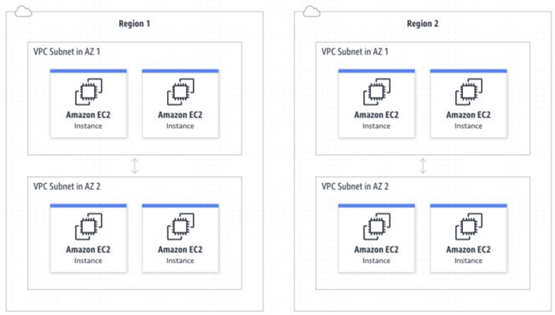
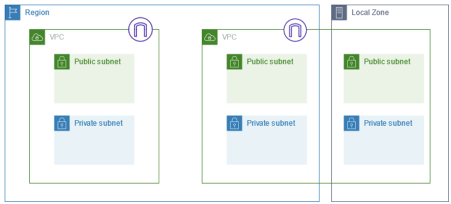
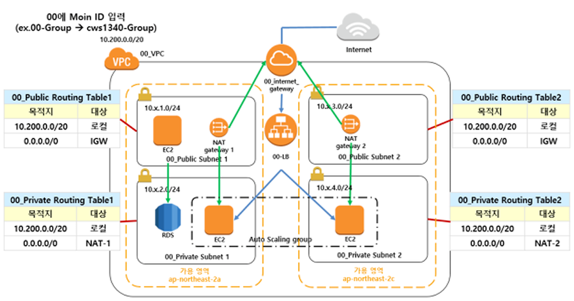
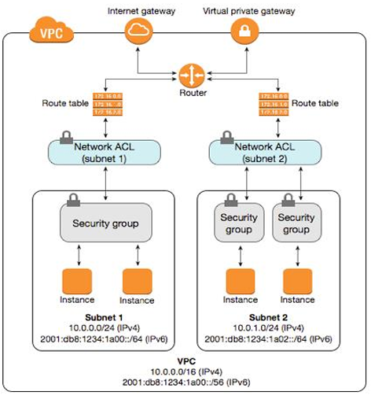
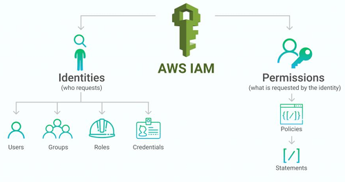

# AWS 서비스 소개

## 1. AWS 클라우드 소개

### 클라우드 컴퓨팅이란

클라우드 컴퓨팅은 컴퓨팅 리소스를 인터넷을 통해 서비스로 사용할 수 있는 주문형 서비스입니다.
기업은 직접 리소스를 조달하거나 구성, 관리할 필요 없이 사용한 만큼만 비용을 지불하면 됩니다.
(출처: Google)

클라우드 컴퓨팅은 IT 리소스를 인터넷을 통해 온디맨드 방식으로 제공하며, 사용한 만큼만 비용을 지불하는 것을 의미합니다.
물리적 데이터센터와 서버를 구입, 소유, 유지 관리하는 대신 Amazon Web Services(AWS)와 같은 클라우드 공급자를 통해 필요에 따라 컴퓨팅 파워, 스토리지, 데이터베이스와 같은 기술 서비스를 액세스할 수 있습니다.
(출처: Amazon)

### 클라우드 컴퓨팅 모델

 - `서비스형 인프라 (IaaS, Infrastructure as a Service)`
    - IaaS에는 클라우드 IT를 위한 기본 빌딩 블록이 포함되어 있으며, 일반적으로 네트워킹 기능, 컴퓨팅(가상 또는 전용 하드웨어), 데이터 스토리지 공간에 대한 액세스를 제공합니다.
    - IaaS는 IT 리소스에 대한 최고 수준의 유연성과 관리 제어 기능을 제공하며, 기존 IT 리소스와 가장 유사하여 많은 IT 부서와 개발자에게 익숙합니다.
 - `서비스형 플랫폼 (PaaS, Platform as a Service)`
    - PaaS를 사용하면 기본 인프라(일반적으로 하드웨어와 운영체제)를 관리할 필요 없이 애플리케이션 개발과 관리에 집중할 수 있습니다.
    - 애플리케이션 실행과 관련된 리소스 구매, 용량 계획, 소프트웨어 유지관리, 패치 작업 등 획일적인 작업에 대한 부담 없이 효율적으로 운영할 수 있습니다.
 - `서비스형 소프트웨어 (SaaS, Software as a Service)`
    - SaaS는 서비스 공급자가 실행하고 관리하는 완전한 제품을 제공합니다.
    - 대부분의 경우 SaaS는 웹 기반 이메일과 같은 최종 사용자 애플리케이션을 의미합니다. SaaS 오퍼링은 서비스 유지관리나 기본 인프라 관리에 대해 고민할 필요 없이, 특정 소프트웨어를 어떻게 사용할지만 생각하면 됩니다.

### AWS 서비스 알아보기

 - EC2 (Elastic Compute Cloud): 클라우드에서 제공하는 가상 서버
 - S3 (Simple Storage Service): 확장 가능한 스토리지 서비스
 - Aurora: 고성능 관리형 관계형 데이터베이스
 - DynamoDB: NoSQL 데이터베이스
 - RDS (Relational Database Service): 관리형 관계형 데이터베이스
 - Lambda: 서버리스 함수 실행 서비스
 - VPC (Virtual Private Cloud): 격리된 클라우드 리소스
 - SageMaker: 기계 학습 모델을 대규모로 구축, 훈련 및 배포하는 서비스

## 2. 빅데이터 관련 서비스 소개

 - `빅데이터 프레임워크 EMR(Elastic MapReduce)`
    - 목적별 빅데이터 프레임워크 패키지 제공
    - EMR Studio: 주피터 노트북 통합 개발 환경
    - EMR Serverless: 클러스터 및 서버 관리 없이 빅 데이터 애플리케이션 실행
 - `실시간 스트림 분석 Kinesis`
    - Kinesis Video Streams: 재생, 분석 및 기계 학습을 위해 미디어 스트림을 캡처, 처리 및 저장
    - Kinesis Data Streams: 관리할 서버 없이 모든 규모에서 쉽게 데이터를 스트리밍
    - Kinesis Data Firehose: 스트리밍 데이터를 안정적으로 캡처하고 전환하여 저장소, 분석 서비스에 전달하는 ETL 서비스
    - Kinesis Data Analytics: Apache Flink를 사용하여 실시간으로 스트리밍 데이터를 변환하고 분석할 수 있는 서비스
 - `데이터 웨어하우스 Redshift`
    - Redshift: 클라우드에서 완벽하게 관리되는 페타바이트급 데이터 웨어하우스 서비스입니다. 자체 쿼리 편집기를 제공하며, 다양한 BI 도구(QuickSight, Tableau, Power BI), 노트북, SQL 클라이언트 도구와의 연결을 지원합니다.
    - Redshift Serverless: 데이터 웨어하우스 인프라 관리할 필요없이 대규모 분석 실행
 - `MWAA(Amazon Managed Workflow for Apache Airflow)`
    - 관리형 Airflow
        - Airflow는 '워크플로우'라고 하는 프로세스 및 작업의 순서를 프로그래밍 방식으로 작성, 예약, 모니터링하는 데 사용되는 오픈소스 도구입니다.
        - **MWAA (Managed Workflows for Apache Airflow)**는 Airflow를 확장성, 가용성, 보안을 갖춘 상태로 제공하며, 기본 인프라를 직접 관리할 필요 없이 워크플로우를 생성할 수 있도록 지원하는 서비스입니다.
    - MWAA with EMR and Glue
        - Airflow Operator를 사용하여 EMR에서 데이터 처리가 필요한 작업(ETL)을 수행한 후,
        - Glue를 통해 정제된 데이터를 조회할 수 있도록 하는 일련의 파이프라인을 스케줄링하고 모니터링할 수 있습니다.

## 3. 인프라 관련 서비스 소개

### VPC

 - 논리적으로 격리된 가상 네트워크
 - VPC내에 리소스 배치, 연결 및 보안을 포함하여 가상 네트워크 환경을 제어할 수 잇음

    

### Subnet

 - VPC의 IP 주소 범위
 - 인터넷에 연결되어야 하는 리소스에는 퍼블릭 서브넷을 사용
 - 인터넷에 연결되지 않는  리소스에는 프라이빗 서브넷을 사용

    

### 인터넷 게이트웨이와 NAT 게이트웨이

 - `Internet Gateway`
    - 수평 확장되고 가용성이 높은 중복 VPC 구성 요소로 VPC와 인터넷 간에 통신할 수 있도록 함
    - IPv4 트래픽 및 IPv6 트래픽 지원
    - 네트워크 트래픽에 가용성 위험이나 대역폭 제약이 발생하지 않음
 - `NAT(Network Address Transiation) Gateway` 
    - 네트워크 주소 변환 서비스
    - 프라이빗 서브넷의 인스턴스가 VPC 외부의 서비스에 연결할 수 있지만 외부 서비스에서 이러한 인스턴스와의 연결을 시작할 수 없도록 NAT 게이트웨이를 사용

    

### NACL과 SG

 - `Network Access Control List`
    - 네트워크 액세스 제어 목록은 서브넷 수준에서 특정 인바운드 또는 아웃바운드 트래픽을 허용하거나 거부
 - `Security Group`
    - 보안 그룹은 연결된 리소스에 도달하고 나갈 수 있는 트래픽을 제어

    

### IAM

 - Identity and Access Management
 - AWS 리소스에 대한 액세스를 안전하게 제어할 수 있는 웹 서비스
 - IAM을 사용하여 리소스를 사용하도록 인증 및 권한 부여된 대상을 제어

    

### 요약

 - `1. VPC (Virtual Private Cloud)`
    - VPC는 AWS에서 사용자가 제어할 수 있는 가상 네트워크입니다. 사용자는 VPC를 통해 네트워크 구성을 세밀하게 제어하고, 서브넷, 라우팅 테이블, 보안 그룹 등을 설정할 수 있습니다. VPC 내에서는 IP 주소 범위, 서브넷, 라우팅 정책 등을 정의할 수 있어 독립적이고 격리된 네트워크 환경을 제공합니다.
 - `2. Subnet (서브넷)`
    - 서브넷은 VPC의 IP 주소 범위를 나눈 작은 네트워크 세그먼트입니다. 서브넷을 사용해 VPC 내에서 네트워크를 구분하고, 퍼블릭 또는 프라이빗 리소스를 배치할 수 있습니다.
        - 퍼블릭 서브넷: 인터넷과 연결된 서브넷으로, 인터넷 게이트웨이를 통해 외부와의 통신이 가능합니다.
        - 프라이빗 서브넷: 인터넷에 직접 접근할 수 없는 서브넷으로, 주로 데이터베이스와 같이 외부 노출이 불필요한 리소스를 배치합니다.
 - `3. 인터넷 게이트웨이 (Internet Gateway)`
    - 인터넷 게이트웨이는 VPC를 인터넷에 연결하기 위한 컴포넌트입니다. 퍼블릭 서브넷의 리소스가 인터넷에 접근하려면 인터넷 게이트웨이를 통해 트래픽이 나가도록 설정해야 합니다. __인터넷 게이트웨이를 사용하여 퍼블릭 서브넷의 EC2 인스턴스가 외부 네트워크와 통신할 수 있게 됩니다.__
 - `4. NAT 게이트웨이 (NAT Gateway)`
    - __NAT 게이트웨이는 프라이빗 서브넷에 있는 리소스가 인터넷에 나가서 외부로 요청을 보내도록 하는 데 사용됩니다. 그러나 인터넷에서 직접 이 리소스로의 접근은 허용되지 않습니다.__ 주로 보안성 향상을 위해 프라이빗 서브넷에 있는 인스턴스가 소프트웨어 업데이트나 외부 API 호출 등의 목적으로 인터넷에 접근할 수 있도록 사용됩니다.
 - `5. NACL (Network Access Control List)`
    - NACL은 VPC의 서브넷 레벨에서 트래픽을 제어하기 위한 보안 레이어입니다. NACL은 허용 또는 거부 규칙을 정의하여 서브넷으로 들어오거나 나가는 트래픽을 필터링합니다. 서브넷 단위로 설정되며, 상태 비저장(stateless)이기 때문에 인바운드와 아웃바운드 규칙을 각각 정의해야 합니다.
 - `6. 보안 그룹 (SG, Security Group)`
    - 보안 그룹은 인스턴스 레벨에서 적용되는 가상 방화벽입니다. __보안 그룹은 인스턴스의 인바운드 및 아웃바운드 트래픽을 제어하는 역할__ 을 하며, 상태 저장(stateful)으로 작동하여 인바운드 규칙에 따른 아웃바운드 트래픽이 자동으로 허용됩니다. 규칙을 통해 특정 IP나 포트에 대한 접근을 허용할 수 있습니다.
 - `7. IAM (Identity and Access Management)`
    - IAM은 AWS 리소스에 대한 접근을 제어하고 관리하는 서비스입니다. 사용자는 IAM을 통해 개별 사용자, 그룹, 역할(Role)을 생성하고 AWS 리소스에 대한 접근 권한을 부여하거나 제한할 수 있습니다. 이를 통해 조직 내의 사용자가 필요한 리소스만 사용할 수 있게 하고, 보안을 강화할 수 있습니다.
        - IAM 사용자: AWS 계정에 로그인하고 작업을 수행할 수 있는 사람이나 서비스 계정.
        - IAM 역할(Role): 권한을 위임받아 리소스에 접근하도록 하는 방식. 주로 EC2 인스턴스나 다른 AWS 서비스에 권한을 부여할 때 사용합니다.

