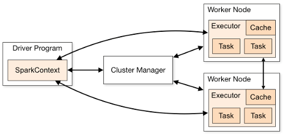
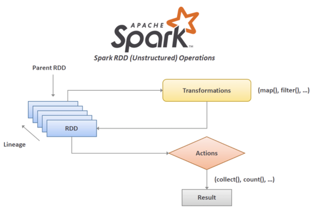
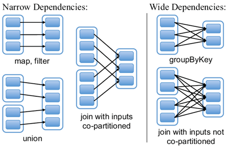
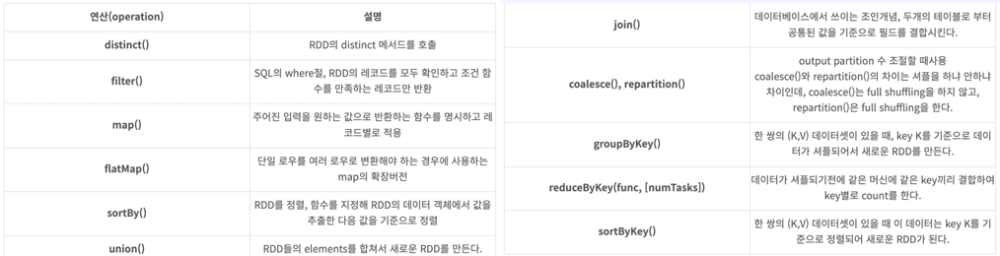
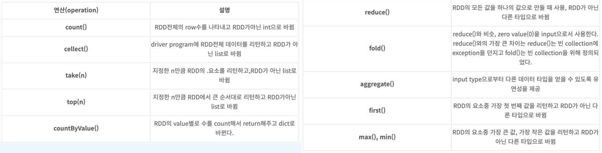
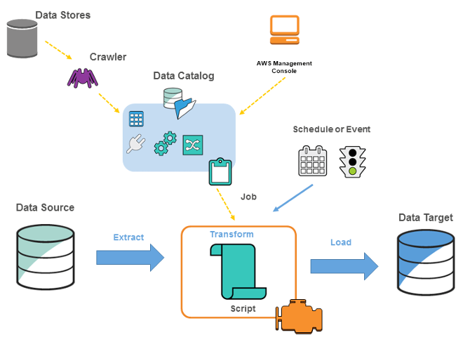

# AWS에서 배치 파이프라인 구축하기

## 1. AWS S3를 저장소로 하는 배치 파이프라인

### 1-1. AWS S3 소개

 - __Amazon Simple Storage Service(S3)__
    - 어디서나 원하는 양의 데이터를 저장하고 검색할 수 있도록 구축된 객체 스토리지
    - 업계 최고 수준의 내구성, 가용성, 성능, 보안 및 거의 무제한의 확장성을 아주 저렴한 요금으로 제공하는 단순한 스토리지 서비스
 - __AWS S3 특징__
    - 추가적인 시스템 관리 없이 많은 사용자가 데이터에 접근 가능
    - 논리적으로 저장되는 파일 수에 제한이 없으며, 하나의 파일 크기는 최대 5TB까지 저장 가능
    - 파일에 대한 접근 제한 기능 제공
    - 데이터 손실을 걱정할 필요 없음
    - 버전 관리를 통해 복원이 가능
    - 데이터의 중요도에 따라 스토리지 클래스별로 구분 저장 가능하며 이를 통해 비용 절감 가능
 - __S3 관련 용어__
    - 객체(Object): S3에 저장된 하나의 데이터(파일, 폴더 등)
    - 버킷(Bucket): 객체들을 보관하는 최상위 디렉토리, 버킷 단위로 다양한 보안 설정이 가능하며 Region 별로 생성
    - 버전 관리: 버전 관리는 객체의 여러 버전을 동일한 버킷에서 관리하기 위한 수단, 각 버전을 보존, 검색 및 복원 가능
    - 스토리지 클래스: 데이터 액세스, 복원력 및 비용 요구 사항에 따라 선택할 수 있는 스토리지 클래스 제공. 가장 기본이 되는 S3 Standard, 자주 액세스 하지 않는 S3 Standard-IA, 거의 액세스 하지 않는 장기 데이터 S3 Glacier Flexible Retrieval 등
 - __AWS S3 버킷 생성 및 데이터 저장__
    - Amazon S3 > 버킷 > 버킷 만들기
        - 버킷 이름: 버킷의 이름
        - AWS 리전: 버킷의 리전. 버킷은 AWS 리전 별로 존재한다.
        - 객체 소유권: ACL 설정(버킷에 저장된 오브젝트의 소유권 및 액세스 제어 목록을 제어)
        - 퍼블릭 액세스 차단 설정
        - 버킷 버전 관리: 의도치 않게 삭제될 경우 버전 관리가 활성화되었다면 복구가 가능
        - 태그: 태그를 지정하여 스토리지 별로 비용을 추적할 수 있다.
```bash
$ aws configure
AWS Access  Key ID
AWS Secret Access Key
Default region name [ap-northeast-2]
Default output format [json]

# 생성된 버킷 확인
$ aws s3 ls /

# 특정 버킷 내에 파일 확인
$ aws s3 ls s3://{butket-name}/

# 실습에 활용할 데이터셋(aws public dataset) 확인
$ aws s3 ls s3://nyc-tlc/
$ aws s3 ls s3://nyc-tlc/csv_backup/
$ aws s3 ls s3://nyc-tlc/"trip data"/
$ aws s3 ls s3://nyc-tlc/"trip data"/ | grep 2022-10

# 데이터셋 복사
$ aws s3 cp s3://nyc-tlc/"trip data"/green_tripdata_2022-10.parquet s3://{butket-name}/input/green_tripdata_2022-10.parquet
$ aws s3 cp s3://nyc-tlc/"trip data"/yellow_tripdata_2022-10.parquet s3://{butket-name}/input/yellow_tripdata_2022-10.parquet

$ aws s3 ls s3://{butket-name}/input/
```

### 1-2. Apache Spark

 - 빅데이터 워크로드에 쓰이는 오픈소스 고속 통합 분석 엔진
 - 2009년 UC Berkeley에서 개발됨.
 - 데이터 처리 분야에서 가장 규모가 큰 오픈소스 프로젝트 중 하나.
 - Netflix, Yahoo, eBay와 같은 대형 인터넷 기업들이 대규모로 Spark를 사용하며, 8,000개 이상의 클러스터에서 페타바이트(PB) 규모의 데이터를 처리함.
 - 현재 250개 이상의 조직에서 1,000명 이상이 기여 중.
 - 인메모리 기반 데이터 처리로, 하둡 맵리듀스(Hadoop MapReduce) 대비 최대 100배 빠른 처리 속도(디스크 사용 시 약 10배 빠름).
 - DAG 스케줄러, 쿼리 최적화 도구, 물리적 실행 엔진을 활용하여 고성능을 제공.
 - 다양한 데이터 저장소 및 생태계와 잘 통합됨.
 - 배치 및 실시간 처리뿐만 아니라 머신러닝 애플리케이션(MLlib)과 그래프 처리(GraphX)를 지원.

 - __Spark의 장점__
    - 속도
        - 여러 병렬 작업에 걸쳐 데이터를 메모리에 캐시하여 빠른 실행 속도를 자랑합니다.
        - 하둡 MapReduce 대비 최대 100배 빠르고, 디스크 기반 처리 시 10배 빠름.
        - 디스크 내 대규모 정렬에서 세계 신기록을 보유하고 있습니다.
    - 실시간 스트림 처리
        - 실시간 스트리밍(mini-batch) 데이터 처리가 가능하며, 다른 프레임워크와의 통합도 지원합니다.
    - 통합 엔진 (여러 워크로드 지원)
        - SQL 쿼리, 스트리밍 데이터, 머신러닝, 그래프 처리를 지원합니다.
        - 높은 수준의 라이브러리 패키지를 통해 생산성을 향상시키고 복잡한 워크플로를 구현할 수 있습니다.
    - 사용 편리성 증가
        - Java, Scala, Python, R과 같은 다양한 프로그래밍 언어를 지원합니다.
        - 데이터 변환을 위한 100개 이상의 연산자 컬렉션을 제공하며, 반구조화된 데이터 조작에 유용한 DataFrame API를 지원합니다.
 - __Apache Spark 에코 시스템__
    - Spark Core API (일반 실행): Spark Core는 Spark 플랫폼의 기본 일반 실행 엔진입니다.
    - Spark SQL + DataFrames (구조화된 데이터): Spark SQL은 구조화된 데이터 처리를 위한 Spark 모듈입니다.
    - 스트리밍 (스트리밍 분석): Spark의 사용 편의성과 내고장성을 그대로 활용하면서도, 스트리밍 데이터와 과거 데이터를 결합하여 강력한 인터랙티브 분석 애플리케이션을 지원합니다.
    - MLlib (머신러닝): MLlib은 확장 가능한 머신러닝 라이브러리로, 고급 알고리즘과 빠른 속도를 제공합니다.
    - GraphX (그래프 계산): GraphX는 Spark를 기반으로 한 그래프 계산 엔진입니다. 사용자가 대규모의 구조화된 그래프 데이터를 상호작용 방식으로 구축, 변환, 추론할 수 있도록 지원합니다.
 - __Spark 구성 요소__
   - Cluster Manager: 애플리케이션의 자원을 할당, 제거하는 등 클러스터의 자원을 관리하는 서비스, built-in된 기본 모듈 Standalone, 핟부에서 사용되는 Yarn, UC Berkelery에서 개발한 Mesos, 컨테이너 오케스트레이션 도구인 Kubernetes를 지원
   - Driver Program: 사용자 애플리케이션의 main 함수를 실행하고 SparkContext를 생성하는 메인 프로세스
   - Job: 사용자 애플리케이션에서 Spark에 요청하는 일련의 작업. 여러 개의 Task로 나뉘어 실행됨
   - Stage: Task의 집합, 물리적 실행 단위 (Job > Stage > Task)
   - Task: Spark Executor에서 수행되는 최소 작업 단위
   - Master Node: 전체 클러스터를 관리하고 Driver Program을 실행하는 노드
   - Worker Node: Task가 수행되는 실제 연산 작업을 수행하는 노드
   - RDD(Resilient Distributed Dataset): 탄력적 분산 데이터 집합이라 불리며, 스파크의 가장 중요한 핵심 요소이면서 스파크 클러스터 전역에 분산되고 변경되지 않는 불변성의 객체
   - DataFrame: named column으로 구성된 데이터 집합으로 개념적으로 관계형 데이터 베이스의 테이블 또는 R/Python의 데이터 프레임과 동일하지만 내부적으로 풍부한 최적화 제공
   - Dataset: Spark SQL의 최적화된 실행 엔진의 이점과 함꼐 RDD 이점을 제공하는 Spark 1.6에 추가된 새로운 인터페이스. RDD와 DataFrame의 장점을 취하며, Type-Safe하고 Catalyst Optimizer를 통한 최적화
<div align="center">
   
</div>
<br/>

#### RDD의 연산

 - Transformation
   - RDD를 새로운 RDD로 생성하는 연산
   - Lazy Evaluation 특성에 따라 Action이 있기 전까지 실제로 일어나지 않는다.
   - 연속된 Transformation은 Lineage를 생성
 - RDD Lineage - Logical Execution Plan
   - RDD의 모든 상위 RDD에 대한 그래프
   - RDD에 Transformation을 적용한 결과로 구축되며 논리적 실행 계획을 생성
<div align="center">
   
</div>
<br/>

 - `RDD의 연산 - Transformation의 종류`
   - Narrow Transformation: 하나의 연산이 수행될 데이터가 하나의 노드에 바로 있어서 수행되는 것으로 map, filter, union 등의 연산 시 수행
   - Wide Transformation: 연산 처리되어야 할 데이터 클러스터 노드 여기저기에 분산되어 있어서 연산 처리 수행 시, 메모리 간의 전달량이 많아지는 것, 네트워크 연산 처리량이 많아지므로 애플리케이션 수행 속도에 영향
<div align="center">
   
</div>
<br/>

 - `RDD의 연산 - Transformation의 연산 종류`

<div align="center">
   
</div>
<br/>

#### RDD - Action

 - Action: Transformation을 실제로 실행하는 연산
 - RDD에서 non-RDD로 변환
 - 실제 데이터를 가지고 작업해야 하는 연산들, 즉 메모리에 올려야되는 연산들
 - action의 값들은 drivers에 저장되거나 외부의 storage system에 저장

<div align="center">
   <br/>
   
</div>
<br/>

### 1-3. Apache Spark에서 S3 데이터를 읽고 쓰기

#### Apache Spark 애플리케이션 작성을 위한 환경 구성

 - `스파크 설치`
```bash
$ pip install pyspark
```

 - `예시 코드`
```python
import pyspark
import pyspark.sql.functions as F
from pyspark.sql import SparkSession

conf = pyspark.SparkConf()
conf.set('spark.driver.host', '127.0.0.1')
conf.set('spark.jars.packages', 'org.apache.hadoop:hadoop-aws:3.3.2')
conf.set('spark.hadoop.fs.s3a.access.key', '액세스키')
conf.set('spark.hadoop.fs.s3a.secret.key', '시크릿키')

spark = SparkSession.builder\
   .config(conf=conf)\
   .appName('s3_rw_example')\
   .getOrCreate()
print(f'hadoop version = {spark._jvm.org.apache.hadoop.util.VersionInfo.getVersion()}')

input_path = 'fastcampus-teest-bucket/input'
output_path = 'fastcampus-teest-bucket/output'
# green_df = spark.read.parquet(f's3a://{input_path}/green_tripdata_2022-10.parquet')
# green_df.show(truncate=False)
# green_df.printSchema()

# S3에서 데이터 읽기
yellow_df = spark.read.parquet(f's3a://{input_path}/yellow_tripdata_2022-10.parquet')
new_yellow_df = yellow_df.selectExpr('VendorID as vendor_id', 
                     'tpep_pickup_datatime as pickup_datetime,
                     'tpep_dropoff_datetime as dropoff_datetime',
                     'RatecodeID as ratecode_id',
                     'PULocationID as pu_location_id',
                     'DOLocationID as do_location_id'
                     ).withColumn('taxi_type', F.lit('yellow'))

green_df = spark.read.parquet(f's3a://{input_path}/green_tripdata_2022-10.parquet')
new_green_df = green_df.selectExpr('VendorID as vendor_id', 
                     'lpep_pickup_datatime as pickup_datetime,
                     'lpep_dropoff_datetime as dropoff_datetime',
                     'RatecodeID as ratecode_id',
                     'PULocationID as pu_location_id',
                     'DOLocationID as do_location_id',
                     'payment_type',
                     'fare_amount',
                     'extra', 'mta_tax', 'tip_amount', 'tolls_amount',
                     'total_amount', 'congestion_surcharge'
                     ).withColumn('taxi_type', F.lit('green'))

# UNION 연산
union_df = new_yellow_df.union(new_green_df)
union_df.show(truncate=False)
union_df.groupBy('taxi_type').count().show(truncate=False)

# S3에 저장
# union_df.write.csv(f's3a://{output_path}/yellow_green_2022-10/')
union_df.repartition(1)\
   .write.option('header', 'true')\
   .mode('overwrite')\
   .csv(f's3a://{output_path}/yellow_green_2022-10/')
```

 - `파일 확인`
```bash
# 파일 확인
$ aws s3 ls s3://fastcampus-test-bucket/output/
$ aws s3 ls s3://fastcampus-test-bucket/output/yellow_green_2022-10/

# 파일 다운롣르
$ aws s3 cp s3://fastcampus-test-bucket/output/yellow_green_2022-10/파일명 .
```

### 1-4. AWS Glue

 - 분석 사용자가 여러 소스의 데이터를 쉽게 검색, 준비, 이동, 통합할 수 있도록 지원하는 서버리스 데이터 통합 서비스입니다.
 - 작성, 작업 실행, 비즈니스 워크플로 구현을 위한 추가 생산성 도구 및 데이터  - 운영 도구를 제공합니다.
 - 70개 이상의 다양한 데이터 소스 연결을 지원합니다.
 - 중앙집중식 데이터 카탈로그를 통해 데이터를 관리할 수 있습니다.
 - ETL 파이프라인을 시각적으로 생성, 실행, 모니터링할 수 있습니다.
 - 데이터 레이크에 데이터를 로드하거나, Athena, EMR, Redshift Spectrum을 사용하여 카탈로그화된 데이터를 즉시 검색하고 쿼리할 수 있습니다.
 - ETL, ELT, Streaming과 같은 모든 워크로드를 하나의 서비스에서 유연하게 지원합니다.
 - __이벤트 기반 ETL__: AWS Glue를 사용하면 새 데이터가 도착하는 대로 추출, 전환, 적재(ETL) 작업을 실행할 수 있다. 예를 들어, S3에서 새 데이터를 사용할 수 있게 되는 즉시 실행할 ETL 작업을 시작하도록 AWS Glue를 구성할 수 있다.
 - __데이터 카탈로그__: 데이터 카탈로그를 사용하면 데이터를 이동하지 않고도 여러 AWS 데이터 세트 전체에서 신속하게 데이터를 검색할 수 있다. 일단 데이터가 카탈로그에 저장되면 Amazon Athena, Amazon EMR 및 Amazon Redshift Spectrum에서 즉시 검색 및 쿼리에 데이터를 사용할 수 있다.
 - __노 코드 ETL 작업__: AWS Glue Studio를 사용하면 AWS Glue ETL 작업을 시각적으로 간편하게 생성, 실행 및 모니터링 할 수 있다. 드래그 앤 드롭 방식의 편집기를 사용하여 데이터를 이동 및 변환하는 ETL 작업을 구축할 수 있으며 AWS Glue가 자동으로 코드를 생성한다.
 - __셀프 서비스 데이터 준비__: AWS Glue DataBrew를 사용하면 Amazon S3, Redshift, Lake Formation, Aurora 및 RDS를 비롯한 데이터 레이크, 데이터 웨어하우스 및 데이터베이스에서 직접 데이터를 탐색하고 데이터를 실험할 수 있다. DataBrew의 사전 구축된 250여 개의 변환 중에서 선택하여 이상 항목 필터링, 형식 표준화, 잘못된 값 수정 등의 데이터 준비 작업을 자동화할 수 있다.

<div align="center">
   
</div>
<br/>

#### AWS Glue 용어

 - __1. AWS Glue Data Catalog__
   - AWS Glue의 영구적 메타데이터 스토어로, 테이블 정의, 작업 정의, 기타 관리 정보를 포함하여 AWS Glue 환경을 관리합니다.
   - 각 AWS 계정의 **리전(region)**당 하나씩 존재합니다.
 - __2. 분류자 (Classifier)__
   - 데이터 스키마를 결정하는 역할을 합니다.
   - CSV, JSON, AVRO, XML 등 일반 파일 형식에 대한 분류자뿐만 아니라 JDBC 연결을 사용한 일반 관계형 데이터베이스 관리 시스템(RDBMS)을 위한 분류자를 제공합니다.
 - __3. 연결 (Connection)__
   - 특정 데이터스토어에 연결하는 데 필요한 속성을 포함하는 Data Catalog 객체입니다.
 - __4. 크롤러 (Crawler)__
   - 데이터스토어(소스 또는 대상)에 연결하는 프로그램입니다.
   - 분류자의 우선순위 지정 목록을 통해 데이터의 스키마를 결정한 뒤, AWS Glue Data Catalog에 메타데이터 테이블을 생성합니다.

#### AWS Glue의 데이터 카탈로그 및 크롤러

 - 1. AWS Glue > Data Catalog > Databases 생성
 - 2. AWS Glue > Data Catalog > Crawlers 생성
   - Data Source: S3
   - S3 path: 경로 지정
   - Subsequent crawler runs: Crawl all sub-folders
   - IAM role: 롤 생성
   - Output Target database: DB 타겟 지정


 - `예제 코드`
   - 09월, 10월 데이터를 순회하여 UNION 처리 후 S3에 업로드
```python
import pyspark
import pyspark.sql.functions as F
from pyspark.sql import SparkSession

conf = pyspark.SparkConf()
conf.set('spark.driver.host', '127.0.0.1')
conf.set('spark.jars.packages', 'org.apache.hadoop:hadoop-aws:3.3.2')
conf.set('spark.hadoop.fs.s3a.access.key', '액세스키')
conf.set('spark.hadoop.fs.s3a.secret.key', '시크릿키')

spark = SparkSession.builder\
   .config(conf=conf)\
   .appName('s3_rw_example')\
   .getOrCreate()
print(f'hadoop version = {spark._jvm.org.apache.hadoop.util.VersionInfo.getVersion()}')

input_path = 'fastcampus-teest-bucket/input'
output_path = 'fastcampus-teest-bucket/output'

new_cols_expr = ['VendorID as vendor_id', 'RatecodeID as ratecode_id', 'PULocationID as pu_location_id', 'DOLocationID as do_location_id',
   'payment_type', 'fare_amount', 'extra', 'mta_tax', 'tip_amount', 'improvement_surcharge', 'tolls_amount', 'total_amount', 'congestion_surcharge']

yellow_cols = ['tpep_pickup_datatime as pickup_datetime', 'tpep_dropoff_datetime as dropoff_datetime']
yellow_cols.extend(new_cols_expr)

green_cols = ['lpep_pickup_datatime as pickup_datetime', 'lpep_dropoff_datetime as dropoff_datetime']
green_cols.extend(new_cols_expr)

for ym in ['2022-09', '2022-10']:
   yellow_df = spark.read.parquet(f's3a://{input_path}/yellow_tripdata_{ym}.parquet')\
         .selectExpr(yellow_cols).withColumn('taxi_type', F.lit('yellow'))
   green_df = spark.read.parquet(f's3a://{input_path}/green_tripdata_{ym}.parquet')\
         .selectExpr(green_cols).withColumn('taxi_type', F.lit('green'))
   union_df = yellow_df.union(green_df)
   union_df.repartition(1)\
         .write.option('header', 'true')\
         .mode('overwrite')\
         .csv(f's3a://{output_path}/ym={ym}/')
```

#### AWS Glue Data Integration and ETL

```
1. AWS Glue 대시보드 > Data Integration and ETL > AWS Glue Studio > View Jobs
 - Spark script editor 선택 > Create

2. I AM Role
 - 유형: AWS 서비스
 - 사용 사례: Glue
 - 권한 정책: Glue 검색
   -> AWSGlueServiceRole 선택

```
